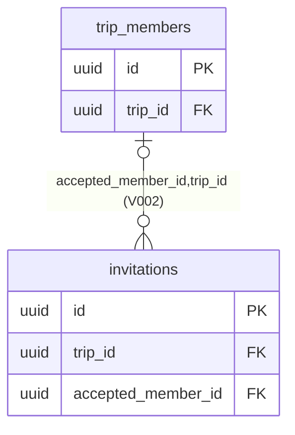

# Hướng dẫn cập nhật SRS API ERD Wolfari

> Hồ sơ lịch sử của đợt đồng bộ 01–02/10/2026. Người yêu cầu đã chốt bộ mới ngày 02/10/2026; nhãn “dự thảo/chờ duyệt”, đường dẫn nguồn và kết quả kiểm thử bên dưới phản ánh thời điểm lập hồ sơ, không phải trạng thái hiện hành. Xem [danh mục tài liệu chính thức](../README.md) và [hồ sơ chốt phiên bản](../releases/2026-10-02-documentation-baseline.md). Không áp dụng lại 80 thao tác lên bản chính thức.

Bản review ngày 01/10/2026 dùng source trên nền commit `63aa8b4875a61f4f87ce2c9aa73a3e29b2537063`, nhánh `feat/trip-invitations`, cộng các sửa local trong đợt review này. File này tập hợp 80 mục sửa ba DOCX, các thay đổi trực tiếp trong repo, bằng chứng kiểm thử và phần còn thiếu. Không phải báo cáo hoàn thành toàn bộ MVP.

## Bộ DOCX đã cập nhật ngày 02/10/2026

Đã áp dụng đủ **80 mục** vào ba bản sao, đồng bộ phiên bản và kiểm tra nội dung/bố cục. Bộ mới vẫn là **dự thảo chờ duyệt**; ngày 01/10 trong trang đầu và lịch sử phiên bản là mốc review của guide, ngày 02/10 là mốc hoàn tất chỉnh DOCX.

| Bản cập nhật                                                                                                    | Số trang bản render kiểm tra | Nguồn giữ nguyên                        |
| --------------------------------------------------------------------------------------------------------------- | ---------------------------: | --------------------------------------- |
| SRS v2.3 dự thảo, nay là [bản chính thức](../Wolfari_SRS_v2.3_ChinhThuc.docx)                                   |                           57 | SRS v2.0, tra cứu lịch sử Git           |
| ERD v1.2 dự thảo, nay là [bản chính thức](../Wolfari_ERD_Database_v1.2_ChinhThuc.docx)                          |                           50 | ERD v1.1, tra cứu lịch sử Git           |
| DDL/API/Event v1.1 dự thảo, nay là [bản chính thức](../Wolfari_DDL_API_Event_Specification_v1.1_ChinhThuc.docx) |                           42 | DDL/API/Event v1.0, tra cứu lịch sử Git |

Sau yêu cầu dọn nội dung thừa/lỗi thời, đã sửa thêm **15 tham chiếu và dòng trạng thái** theo bảng bổ sung ở cuối guide. Bảng bổ sung là phần áp dụng sau cùng nếu trùng với nội dung mới của SRS-02, SRS-22 hoặc SRS-28; 80 mục gốc được giữ để truy vết. Không thay đổi nghiệp vụ ngoài guide, không sửa source ứng dụng, V001/V002 hoặc manifest trong lượt chỉnh DOCX này.

Lưu ý nguồn: file SRS v2.0 được cung cấp **đã không có Phụ lục A và ảnh ERD nhúng**, dù mục lục và vài đoạn còn nhắc chúng. Bản mới chỉ bỏ mục lục trỏ đến phần không tồn tại và sửa tham chiếu về mục 10/13.2; không xóa hình hay phụ lục có trong file nguồn. Phụ lục B, lịch sử QD01–QD25 và các yêu cầu chưa triển khai vẫn giữ nguyên.

## Cách dùng và bản gốc

1. Tạo bản sao ba DOCX trước khi sửa. File gốc trong repo chưa bị chỉnh sửa.
2. Mỗi mục dưới ghi rõ tài liệu, tiêu đề/FR/API/bảng, thao tác, nội dung cũ nguyên văn và nội dung mới để dán. Chỉ xóa đoạn/ô/hàng được chỉ định; không xóa cả FR, mục, bảng hoặc yêu cầu chưa triển khai.
3. P là số đoạn XML trong file gốc, tính cả đoạn trong ô bảng, dùng đối chiếu kỹ thuật; **không phải số trang Word**. Tìm theo heading và câu/ô cũ. Một số tên field trong DOCX có ký tự zero-width; nếu Find toàn câu không ra, tìm tên FR/API hoặc vài từ đầu. Nội dung cũ bên dưới giữ nguyên các ký tự nguồn.
4. Với bảng, phần cũ liệt kê nội dung ô theo thứ tự đọc; phần mới là bảng Markdown để chuyển sang Word. Giữ một hàng tiêu đề, không dán thêm hàng tiêu đề trùng khi chỉ thêm/sửa hàng dữ liệu. Giữ thứ tự các ô cũ nếu thay đúng một ô.
5. Bộ sửa đã lưu riêng với số **SRS 2.3 dự thảo, ERD 1.2 dự thảo, DDL/API/Event 1.1 dự thảo** để không nhầm với các tham chiếu 2.1/2.2 cũ. Nhãn dự thảo không thay thế phê duyệt chính thức.
6. Giữ nguyên lịch sử phê duyệt QD01–QD25 và tài liệu nguồn. Không replace-all mọi chữ “2.0”, “1.1” hoặc “V001”: lịch sử và nguồn gốc phải được bảo toàn. Việc Phụ lục A/ảnh ERD đã thiếu trong file SRS nguồn được ghi riêng ở trên.
7. Mục lục/cross-reference và bố cục đã kiểm tra trên bộ DOCX mới bằng OOXML và render. Nếu tiếp tục sửa nội dung trong Word, cần cập nhật lại mục lục/field và kiểm tra bố cục; số trang có thể khác theo môi trường Word/font.

| File gốc                                      | SHA-256                                                            |
| --------------------------------------------- | ------------------------------------------------------------------ |
| Wolfari_SRS_v2.0_ChinhThuc.docx               | `7f1326f0ec92aa1794f6a0e08235a9049feca4820e0f311a6644759e0f5e7c7e` |
| Wolfari_DDL_API_Event_Specification_v1.0.docx | `f4f88441d7985219fff65073d5f72b95f7efc59d450157a6eebfe8505593d009` |
| Wolfari_ERD_Database_v1.1_ChinhThuc.docx      | `3a7907cfdecc78326907f7093897025c12dd00229f0b2db0621e10bbfd3176bf` |

Nếu checksum file Word bạn đang chỉnh khác bảng này, xác minh đoạn cũ trước khi áp dụng; không dùng số P để sửa mù. Trong chính file tên SRS v2.0, mục 10/12 có nhắc “bản thay thế 2.1”; hai DOCX khác nhắc 2.2 nhưng file 2.2 không có. Hướng dẫn này đối chiếu nội dung thực của ba file trên, không suy diễn nội dung bản thiếu.

## Danh mục thay đổi

| Mã                | Tài liệu | Vị trí                                                                    | Thao tác               |
| ----------------- | -------- | ------------------------------------------------------------------------- | ---------------------- |
| [SRS-01](#srs-01) | SRS      | Trang đầu; dòng phiên bản                                                 | THAY THẾ               |
| [SRS-02](#srs-02) | SRS      | Trang đầu; quy ước tô vàng                                                | THAY THẾ               |
| [SRS-03](#srs-03) | SRS      | Kiểm soát tài liệu; ô Phiên bản                                           | THAY THẾ               |
| [SRS-04](#srs-04) | SRS      | Kiểm soát tài liệu; ô Trạng thái yêu cầu                                  | THAY THẾ               |
| [SRS-05](#srs-05) | SRS      | Lịch sử phiên bản; thêm hàng sau hàng 2.0                                 | CHÈN SAU               |
| [SRS-06](#srs-06) | SRS      | Mục 1.5; ô Công nghệ kiểm thử                                             | THAY THẾ               |
| [SRS-07](#srs-07) | SRS      | Mục 1.5; ô Vai trò openpyxl/JUnit                                         | THAY THẾ               |
| [SRS-08](#srs-08) | SRS      | Mục 2.3; đoạn điều kiện chung                                             | THAY THẾ               |
| [SRS-09](#srs-09) | SRS      | Mục 4.2; đoạn trạng thái invitation                                       | THAY THẾ               |
| [SRS-10](#srs-10) | SRS      | FR-ID01; đoạn luồng email và Google                                       | THAY THẾ               |
| [SRS-11](#srs-11) | SRS      | FR-ID02; chèn sau AC-ID02                                                 | CHÈN SAU               |
| [SRS-12](#srs-12) | SRS      | FR-TR01 và FR-TR02; chèn sau AC-TR02                                      | CHÈN SAU               |
| [SRS-13](#srs-13) | SRS      | FR-TR03; ô Actor và service                                               | THAY THẾ               |
| [SRS-14](#srs-14) | SRS      | FR-TR03; ba đoạn sau bảng                                                 | THAY THẾ               |
| [SRS-15](#srs-15) | SRS      | FR-TR04; đoạn khóa và selected editors                                    | THAY THẾ               |
| [SRS-16](#srs-16) | SRS      | Mục 6.2; ô cơ chế Gateway → Identity                                      | THAY THẾ               |
| [SRS-17](#srs-17) | SRS      | Mục 6.2; đoạn RPC bổ sung                                                 | THAY THẾ               |
| [SRS-18](#srs-18) | SRS      | Mục 6.4; ô khóa chống lặp                                                 | THAY THẾ               |
| [SRS-19](#srs-19) | SRS      | Mục 6.3; chèn sau quy tắc deadline                                        | CHÈN SAU               |
| [SRS-20](#srs-20) | SRS      | FR-AU01; chèn sau đoạn quy định inbox/preference                          | CHÈN SAU               |
| [SRS-21](#srs-21) | SRS      | Mục 9.3; chèn hai hàng cuối bảng message sau AccountStatusChanged         | CHÈN SAU               |
| [SRS-22](#srs-22) | SRS      | Mục 10.1; đoạn mô tả nguồn chuẩn                                          | THAY THẾ               |
| [SRS-23](#srs-23) | SRS      | Mục 10.1; hai ô tên tài liệu trong bảng                                   | THAY THẾ               |
| [SRS-24](#srs-24) | SRS      | Mục 10.3; ô DR-09                                                         | THAY THẾ               |
| [SRS-25](#srs-25) | SRS      | Mục 10.3; chèn sau hàng DR-10                                             | CHÈN SAU               |
| [SRS-26](#srs-26) | SRS      | Mục 10.5; chèn sau dòng cấm log secret                                    | CHÈN SAU               |
| [SRS-27](#srs-27) | SRS      | Mục 11.4; đoạn công cụ kiểm thử                                           | THAY THẾ               |
| [SRS-28](#srs-28) | SRS      | Mục 12.1; thay nội dung bảng trạng thái, giữ tiêu đề 12.1                 | THAY THẾ               |
| [SRS-29](#srs-29) | SRS      | Mục 12.2; thay sáu bước triển khai cũ                                     | THAY THẾ               |
| [API-01](#api-01) | API      | Trang đầu; ô Phiên bản                                                    | THAY THẾ               |
| [API-02](#api-02) | API      | Trang đầu; ô Trạng thái                                                   | THAY THẾ               |
| [API-03](#api-03) | API      | Trang đầu; ô Bộ tài liệu đồng bộ                                          | THAY THẾ               |
| [API-04](#api-04) | API      | Mục 1; đoạn số lượng                                                      | THAY THẾ               |
| [API-05](#api-05) | API      | Mục 2; bảng đường dẫn DDL                                                 | THAY THẾ               |
| [API-06](#api-06) | API      | Mục 2; đoạn chạy migration                                                | THAY THẾ               |
| [API-07](#api-07) | API      | Mục 2; đoạn rollback                                                      | THAY THẾ               |
| [API-08](#api-08) | API      | Mục 3.1; ô Trip mutation                                                  | THAY THẾ               |
| [API-09](#api-09) | API      | Mục 3.1; đoạn correlation và outcome                                      | THAY THẾ               |
| [API-10](#api-10) | API      | Mục 3.2; hàng lỗi 503                                                     | THAY THẾ               |
| [API-11](#api-11) | API      | Mục 4.1; ô Membership                                                     | THAY THẾ               |
| [API-12](#api-12) | API      | Mục 4.1; ô Invitation                                                     | THAY THẾ               |
| [API-13](#api-13) | API      | FR-ID01; chèn hàng API171 vào bảng, sau API008                            | CHÈN SAU               |
| [API-14](#api-14) | API      | FR-ID01; ô API004 request/response                                        | THAY THẾ               |
| [API-15](#api-15) | API      | FR-ID02; ô API014 request/response                                        | THAY THẾ               |
| [API-16](#api-16) | API      | FR-ID02; ô API165 và chèn API172 sau hàng API165                          | THAY THẾ               |
| [API-17](#api-17) | API      | FR-TR01; ô API017 request/response                                        | THAY THẾ               |
| [API-18](#api-18) | API      | FR-TR02; ô API022 request/response                                        | THAY THẾ               |
| [API-19](#api-19) | API      | FR-TR03; thay toàn bộ bảng endpoint                                       | THAY THẾ               |
| [API-20](#api-20) | API      | FR-TR04; chèn sau ô API031                                                | CHÈN SAU               |
| [API-21](#api-21) | API      | Mục 6; chèn sau bảng RPC cũ, trước đoạn Mapping lỗi                       | CHÈN SAU               |
| [API-22](#api-22) | API      | Mục 6; ô Trip.GetInvitationDelivery                                       | THAY THẾ               |
| [API-23](#api-23) | API      | Mục 6; đoạn Mapping lỗi                                                   | THAY THẾ               |
| [API-24](#api-24) | API      | Mục 7; MemberInvited, ô Local effect                                      | THAY THẾ               |
| [API-25](#api-25) | API      | Mục 7; MemberJoined, ô Local effect                                       | THAY THẾ               |
| [API-26](#api-26) | API      | Mục 7; AccountEmailRequested, ô Local effect                              | THAY THẾ               |
| [API-27](#api-27) | API      | Mục 7.1; thay đoạn reliability chung                                      | THAY THẾ               |
| [API-28](#api-28) | API      | Mục 8.1; ô truy vết FR-ID01                                               | THAY THẾ               |
| [API-29](#api-29) | API      | Mục 8.1; ô truy vết FR-ID02                                               | THAY THẾ               |
| [API-30](#api-30) | API      | Mục 8.1; ô truy vết FR-TR03                                               | THAY THẾ               |
| [API-31](#api-31) | API      | Mục 9; hai dòng nguồn nội bộ                                              | THAY THẾ               |
| [ERD-01](#erd-01) | ERD      | Trang đầu; đoạn mô tả mô hình                                             | THAY THẾ               |
| [ERD-02](#erd-02) | ERD      | Trang đầu; ô Phiên bản                                                    | THAY THẾ               |
| [ERD-03](#erd-03) | ERD      | Trang đầu; ô Trạng thái                                                   | THAY THẾ               |
| [ERD-04](#erd-04) | ERD      | Trang đầu; ô Bộ tài liệu đồng bộ                                          | THAY THẾ               |
| [ERD-05](#erd-05) | ERD      | Mục 1; đoạn ưu tiên nguồn                                                 | THAY THẾ               |
| [ERD-06](#erd-06) | ERD      | Mục 2; dòng Invitation, ô Thiết kế thống nhất                             | THAY THẾ               |
| [ERD-07](#erd-07) | ERD      | Mục 4; đoạn nguồn sơ đồ                                                   | THAY THẾ               |
| [ERD-08](#erd-08) | ERD      | Mục 6.1; invitations, thêm hàng sau resolved_by_user_id                   | CHÈN SAU               |
| [ERD-09](#erd-09) | ERD      | Mục 6.1; invitations, thêm cuối bảng constraints sau INDEX trip_id,status | CHÈN SAU               |
| [ERD-10](#erd-10) | ERD      | Mục 6.1; invitations, đoạn token sau bảng                                 | THAY THẾ               |
| [ERD-11](#erd-11) | ERD      | Mục 10; R02 Membership                                                    | THAY THẾ               |
| [ERD-12](#erd-12) | ERD      | Mục 12; hàng Token delivery context                                       | THAY THẾ               |
| [ERD-13](#erd-13) | ERD      | Mục 12; chèn ghi chú ngay trước tiêu đề mục 13                            | CHÈN TRƯỚC             |
| [ERD-14](#erd-14) | ERD      | Mục 14; hai đoạn migration và vẽ ERD                                      | THAY THẾ               |
| [ERD-15](#erd-15) | ERD      | Mục 6; bảng quan hệ, thêm sau invitations(trip_id)                        | CHÈN SAU               |
| [ERD-16](#erd-16) | ERD      | Mục 6; sơ đồ Trip ngay trước bảng quan hệ                                 | CHỈNH SƠ ĐỒ TẠI VỊ TRÍ |
| [API-32](#api-32) | API      | Mục 6; ô caller Identity.ValidateSession                                  | THAY THẾ               |
| [API-33](#api-33) | API      | Mục 3.2; chèn sau hàng RATE_LIMITED                                       | CHÈN SAU               |
| [API-34](#api-34) | API      | Mục 8; R14 Lưu giữ, chèn ghi chú sau đoạn chính sách                      | CHÈN SAU               |
| [SRS-30](#srs-30) | SRS      | Mục 1.4; đoạn QD05, bổ sung trạng thái triển khai ngay sau đoạn           | CHÈN SAU               |

## Chỉnh SRS

### SRS-01

Tài liệu: `Wolfari_SRS_v2.0_ChinhThuc.docx`. Vị trí: Trang đầu; dòng phiên bản. Đối chiếu nguồn P3.

Thao tác: **THAY THẾ**. Xóa đúng phần cũ bên dưới và dán nội dung mới vào cùng vị trí.

Nội dung cũ cần thay:

```text
Phiên bản 2.0    Ngày 16 tháng 09 năm 2026
```

Nội dung mới:

Phiên bản 2.3 dự thảo cập nhật Ngày 01 tháng 10 năm 2026

Bằng chứng và lý do: Đối chiếu source/contract hiện hành và bảng trạng thái FR trong SRS-28; giữ nguyên phần yêu cầu chưa triển khai.

### SRS-02

Tài liệu: `Wolfari_SRS_v2.0_ChinhThuc.docx`. Vị trí: Trang đầu; quy ước tô vàng. Đối chiếu nguồn P6.

Thao tác: **THAY THẾ**. Xóa đúng phần cũ bên dưới và dán nội dung mới vào cùng vị trí.

Nội dung cũ cần thay:

```text
Nội dung đã duyệt được trình bày không tô vàng. Các diễn giải kỹ thuật mới của phiên bản 2.0 được tô vàng để nhận biết; chúng cụ thể hóa yêu cầu đã duyệt và không tự mở rộng phạm vi sản phẩm. ERD gốc được giữ làm bằng chứng nguồn, không thay thế mô hình database phải cập nhật theo SRS.
```

Nội dung mới:

Bản cập nhật này đối chiếu SRS v2.0 với ERD v1.1, DDL/API/Event v1.0 và implementation trên nền commit 63aa8b4. QD01–QD25 và các yêu cầu chưa triển khai được giữ nguyên. Nội dung cập nhật có mã thay đổi trong hồ sơ đồng bộ; trạng thái đã phê duyệt yêu cầu không đồng nghĩa đã triển khai hoặc đạt nghiệm thu. Các hình ERD gốc tiếp tục được giữ làm bằng chứng nguồn.

Bằng chứng và lý do: Đối chiếu source/contract hiện hành và bảng trạng thái FR trong SRS-28; giữ nguyên phần yêu cầu chưa triển khai.

### SRS-03

Tài liệu: `Wolfari_SRS_v2.0_ChinhThuc.docx`. Vị trí: Kiểm soát tài liệu; ô Phiên bản. Đối chiếu nguồn P31.

Thao tác: **THAY THẾ**. Xóa đúng phần cũ bên dưới và dán nội dung mới vào cùng vị trí.

Nội dung cũ cần thay:

```text
2.0
```

Nội dung mới:

2.3 dự thảo cập nhật từ SRS v2.0

Bằng chứng và lý do: Đối chiếu source/contract hiện hành và bảng trạng thái FR trong SRS-28; giữ nguyên phần yêu cầu chưa triển khai.

### SRS-04

Tài liệu: `Wolfari_SRS_v2.0_ChinhThuc.docx`. Vị trí: Kiểm soát tài liệu; ô Trạng thái yêu cầu. Đối chiếu nguồn P33.

Thao tác: **THAY THẾ**. Xóa đúng phần cũ bên dưới và dán nội dung mới vào cùng vị trí.

Nội dung cũ cần thay:

```text
Đã phê duyệt QD01–QD25 và mục 11 theo xác nhận của người yêu cầu
```

Nội dung mới:

QD01–QD25 và mục 11 giữ phê duyệt gốc. Nội dung cập nhật theo implementation chờ duyệt tài liệu; các chính sách chưa đủ nguồn được ghi rõ là chưa chốt.

Bằng chứng và lý do: Đối chiếu source/contract hiện hành và bảng trạng thái FR trong SRS-28; giữ nguyên phần yêu cầu chưa triển khai.

### SRS-05

Tài liệu: `Wolfari_SRS_v2.0_ChinhThuc.docx`. Vị trí: Lịch sử phiên bản; thêm hàng sau hàng 2.0. Đối chiếu nguồn P54–P56.

Thao tác: **CHÈN SAU**. Giữ nguyên đoạn/hàng mốc; thêm nội dung mới ở phía được chỉ định.

Mốc nguyên văn để tìm:

```text
2.0
16/09/2026
Hợp nhất quyết định được duyệt; chuẩn hóa đặc tả chức năng theo biểu mẫu; bổ sung danh mục dữ liệu đích, quy ước hợp đồng và bảng truy vết triển khai.
```

Nội dung mới:

| Phiên bản   | Ngày       | Nội dung                                                                                                                                                                                        |
| ----------- | ---------- | ----------------------------------------------------------------------------------------------------------------------------------------------------------------------------------------------- |
| 2.3 dự thảo | 01/10/2026 | Đồng bộ nền tảng, Gateway/Identity, Trip core, Plan access, Invitations/email, V002, contracts và trạng thái kiểm chứng. Không xác nhận đã có bản 2.1 hoặc 2.2 độc lập; không giảm phạm vi MVP. |

Bằng chứng và lý do: Đối chiếu source/contract hiện hành và bảng trạng thái FR trong SRS-28; giữ nguyên phần yêu cầu chưa triển khai.

### SRS-06

Tài liệu: `Wolfari_SRS_v2.0_ChinhThuc.docx`. Vị trí: Mục 1.5; ô Công nghệ kiểm thử. Đối chiếu nguồn P163.

Thao tác: **THAY THẾ**. Xóa đúng phần cũ bên dưới và dán nội dung mới vào cùng vị trí.

Nội dung cũ cần thay:

```text
Jest, Selenium, Artillery
```

Nội dung mới:

Vitest cho unit/contract; harness Node.js chạy integration trên Docker riêng; Selenium và Artillery là công cụ dự kiến cho UI/E2E và tải.

Bằng chứng và lý do: Đối chiếu source/contract hiện hành và bảng trạng thái FR trong SRS-28; giữ nguyên phần yêu cầu chưa triển khai.

### SRS-07

Tài liệu: `Wolfari_SRS_v2.0_ChinhThuc.docx`. Vị trí: Mục 1.5; ô Vai trò openpyxl/JUnit. Đối chiếu nguồn P167.

Thao tác: **THAY THẾ**. Xóa đúng phần cũ bên dưới và dán nội dung mới vào cùng vị trí.

Nội dung cũ cần thay:

```text
Với stack TypeScript đã chốt, đường triển khai chính dùng ExcelJS và Jest; hai công cụ này chỉ dùng cho công việc phụ trợ nếu nhóm có nhu cầu.
```

Nội dung mới:

Với stack TypeScript hiện hành, unit/contract dùng Vitest; integration dùng harness Node.js. ExcelJS vẫn là lựa chọn thiết kế cho export chưa triển khai. openpyxl/JUnit được giữ để truy vết nguồn, không phải dependency kiểm thử chính hiện tại.

Bằng chứng và lý do: Đối chiếu source/contract hiện hành và bảng trạng thái FR trong SRS-28; giữ nguyên phần yêu cầu chưa triển khai.

### SRS-08

Tài liệu: `Wolfari_SRS_v2.0_ChinhThuc.docx`. Vị trí: Mục 2.3; đoạn điều kiện chung. Đối chiếu nguồn P202.

Thao tác: **THAY THẾ**. Xóa đúng phần cũ bên dưới và dán nội dung mới vào cùng vị trí.

Nội dung cũ cần thay:

```text
Mọi hành động nội bộ phải kiểm tra tài khoản hợp lệ, membership còn hiệu lực, quyền hiện tại, đối tượng thuộc đúng Trip, trạng thái nghiệp vụ, dữ liệu, version và xác nhận cần thiết. Backend là nơi quyết định quyền; ẩn nút UI không thay thế kiểm tra. Membership không nằm trong JWT. User context nội bộ gồm user_id, system_role và thông tin truy vết cần thiết.
```

Nội dung mới:

Mọi thao tác trên tài nguyên nội bộ Trip phải kiểm tra tài khoản hợp lệ, membership còn hiệu lực, quyền hiện tại, đối tượng thuộc đúng Trip, trạng thái, dữ liệu và version. Backend quyết định quyền; membership không nằm trong JWT. Ngoại lệ có chủ đích: preview/accept/decline invitation dành cho người nhận đã đăng nhập nhưng có thể chưa là thành viên; quyền được xác minh bằng token và Identity, chỉ trả projection giới hạn. Ngoại lệ này không cấp quyền đọc Trip/Plan/Finance trước accept.

Bằng chứng và lý do: apps/trip-workspace-service/src/trip-invitations.service.ts: recipient, tokenCommand; apps/trip-workspace-service/src/trip-access.service.ts

### SRS-09

Tài liệu: `Wolfari_SRS_v2.0_ChinhThuc.docx`. Vị trí: Mục 4.2; đoạn trạng thái invitation. Đối chiếu nguồn P373.

Thao tác: **THAY THẾ**. Xóa đúng phần cũ bên dưới và dán nội dung mới vào cùng vị trí.

Nội dung cũ cần thay:

```text
Invitation: PENDING → ACCEPTED / DECLINED / EXPIRED / REVOKED. Trạng thái kết thúc không đổi lại PENDING. Mời lại tạo invitation mới. TTL mặc định 7 ngày; link là token ngẫu nhiên một lần và chỉ lưu hash. Email invitation phải khớp email đã xác minh; link không gắn email dùng một lần cho người đầu tiên chấp nhận hợp lệ. Owner có thể tạo nhiều link riêng cho nhiều người.
```

Nội dung mới:

Invitation có các chuyển trạng thái PENDING → ACCEPTED / DECLINED / EXPIRED / REVOKED; trạng thái kết thúc không trở lại PENDING. TTL mặc định 7 ngày. EMAIL ràng buộc với email đã chuẩn hóa và xác minh của tài khoản ACTIVE. LINK không gắn email: tài khoản ACTIVE đầu tiên accept hoặc decline hợp lệ sẽ kết thúc lời mời; không bắt buộc email đã xác minh cho LINK.

Token ngẫu nhiên có tiền tố inv1_ và 32 byte entropy; lưu hash SHA-256 có namespace. Riêng EMAIL lưu thêm ciphertext AES-256-GCM ngắn hạn tại Trip để gửi thư, key độc lập nằm ngoài database; không lưu raw token trong event, audit, receipt, log hoặc database Automation. LINK không lưu ciphertext gửi thư. Owner nhận one_time_link chỉ ở lần create đầu tiên; replay create không trả lại link.

Resend chỉ áp dụng EMAIL còn PENDING và còn hạn: giữ ID và expires_at, xoay token, tăng version; token cũ vô hiệu. Invitation đã kết thúc muốn mời lại phải tạo bản ghi mới. Mỗi Trip chỉ có một EMAIL/PENDING cho cùng email chuẩn hóa; create xử lý expiration trước khi kiểm tra trùng.

Bằng chứng và lý do: V002.sql; invitation-crypto.ts; trip-invitations.service.ts

### SRS-10

Tài liệu: `Wolfari_SRS_v2.0_ChinhThuc.docx`. Vị trí: FR-ID01; đoạn luồng email và Google. Đối chiếu nguồn P416.

Thao tác: **THAY THẾ**. Xóa đúng phần cũ bên dưới và dán nội dung mới vào cùng vị trí.

Nội dung cũ cần thay:

```text
Luồng email: nhập email/mật khẩu → chuẩn hóa email và kiểm tra trùng → tạo tài khoản → xác minh email qua liên kết một lần → đăng nhập → cấp access/refresh token. Luồng Google: kiểm tra token/authorization response, issuer, audience và định danh provider → tìm hoặc tạo liên kết tài khoản → cấp phiên Wolfari. Không tự liên kết hai tài khoản chỉ vì chuỗi email trùng; yêu cầu chứng minh quyền tài khoản hiện hữu.
```

Nội dung mới:

Luồng email hiện hành: chuẩn hóa email → tạo tài khoản ACTIVE, credential và token xác minh cùng outbox → gửi email nền. Register trả thông báo chung, không cấp phiên và không tiết lộ email đã tồn tại. Tài khoản ACTIVE được login trước khi xác minh email; EMAIL invitation vẫn bắt buộc email đã xác minh. Xác minh hoặc reset chỉ tiêu thụ token khi người dùng gửi POST; GET từ email scanner không tiêu thụ token.

Access JWT có hạn 15 phút. Refresh có thời hạn tuyệt đối tối đa 30 ngày của family; rotation không gia hạn mốc đó. Phát hiện reuse thu hồi cả family. Web giữ refresh trong cookie HttpOnly/SameSite=Lax và access trong bộ nhớ; refresh cần CSRF và Origin hợp lệ; logout có refresh cookie cũng cần hai kiểm tra này. Logout chỉ dùng Bearer khi không có refresh cookie không dùng CSRF. Mobile nhận refresh trong JSON, không dùng cookie/CSRF. Không gửi đồng thời refresh cookie và refresh_token trong body. Local loopback dùng HTTP; production cần HTTPS/Secure và transport hiện bị chặn khi chưa có TLS.

Luồng Google và account linking vẫn là yêu cầu MVP chưa triển khai: phải kiểm tra token/authorization response, issuer, audience và định danh provider; không tự liên kết tài khoản chỉ vì email trùng.

Bằng chứng và lý do: apps/identity-service/src/identity.service.ts; apps/api-gateway/src/identity-proxy.ts; docs/api/identity.openapi.yaml

### SRS-11

Tài liệu: `Wolfari_SRS_v2.0_ChinhThuc.docx`. Vị trí: FR-ID02; chèn sau AC-ID02. Đối chiếu nguồn P433.

Thao tác: **CHÈN SAU**. Giữ nguyên đoạn/hàng mốc; thêm nội dung mới ở phía được chỉ định.

Mốc nguyên văn để tìm:

```text
AC-ID02: User A không thay hồ sơ/thiết bị của B; logout một thiết bị vô hiệu phiên đó; khóa tài khoản chặn request mới. Request đã bắt đầu hợp lệ có thể hoàn tất theo thứ tự xử lý đã ghi nhận; không dùng JWT cũ để bắt đầu thao tác mới sau khi khóa.
```

Nội dung mới:

Trạng thái hiện hành: đã có GET/PATCH hồ sơ, quản lý phiên Self, đổi/reset mật khẩu và avatar private. PATCH dùng expected_version; upload JPEG/PNG tối đa 10 MiB trả object_key, sau đó PATCH mới gắn vào hồ sơ. GET avatar qua Gateway kiểm quyền và trả ảnh PNG, không cấp object URL công khai. Logout, revoke session, đổi/reset mật khẩu làm phiên liên quan mất hiệu lực theo kiểm tra Identity.

Đổi email, account deletion, OAuth/linking và API Admin khóa/mở khóa chưa triển khai. Khả năng chặn tài khoản có trạng thái LOCKED đã được kiểm thử bằng fixture, không phải bằng chứng đã có API khóa tài khoản.

Bằng chứng và lý do: identity.controller.ts; avatar.service.ts; identity-integration.mjs

### SRS-12

Tài liệu: `Wolfari_SRS_v2.0_ChinhThuc.docx`. Vị trí: FR-TR01 và FR-TR02; chèn sau AC-TR02. Đối chiếu nguồn P464.

Thao tác: **CHÈN SAU**. Giữ nguyên đoạn/hàng mốc; thêm nội dung mới ở phía được chỉ định.

Mốc nguyên văn để tìm:

```text
AC-TR02: Member chỉ đọc Plan vẫn nhân bản được; bản sao không có số dư/QR/link công khai hay người được giao từ Trip gốc. Thay thời gian có activity ngoài khoảng mới phải báo các activity bị ảnh hưởng trước khi lưu.
```

Nội dung mới:

Phạm vi đã triển khai của FR-TR01/02: tạo Trip cùng Owner, danh sách Trip, đọc Trip và Owner sửa name/description/public_description. Create nhận client_request_id; nếu có Idempotency-Key thì phải trùng client_request_id. timezone mặc định Asia/Ho_Chi_Minh; end_at phải lớn hơn start_at. Template, điểm đến và dashboard tổng hợp chưa triển khai.

PATCH hiện chỉ nhận name, description, public_description, expected_plan_version và expected_export_revision, cùng Idempotency-Key. Bỏ field là giữ nguyên; description/public_description nhận null để xóa. Đổi dữ liệu thực sự tăng export_revision, không tăng plan_version hoặc membership_revision; no-op chỉ ghi receipt. Đổi ngày/timezone, date-change preview, duplicate và quản lý template vẫn giữ yêu cầu nhưng chưa được API hiện tại chấp nhận.

Bằng chứng và lý do: trip.service.ts; trip-proxy.ts; docs/api/trip-core.openapi.yaml

### SRS-13

Tài liệu: `Wolfari_SRS_v2.0_ChinhThuc.docx`. Vị trí: FR-TR03; ô Actor và service. Đối chiếu nguồn P469.

Thao tác: **THAY THẾ**. Xóa đúng phần cũ bên dưới và dán nội dung mới vào cùng vị trí.

Nội dung cũ cần thay:

```text
Owner mời hoặc hủy; người nhận accept hoặc decline · Trip Workspace
```

Nội dung mới:

Owner active tạo/list/revoke/resend; người nhận đã đăng nhập preview/accept/decline · Trip Workspace, Identity và Automation.

Bằng chứng và lý do: Đối chiếu source/contract hiện hành và bảng trạng thái FR trong SRS-28; giữ nguyên phần yêu cầu chưa triển khai.

### SRS-14

Tài liệu: `Wolfari_SRS_v2.0_ChinhThuc.docx`. Vị trí: FR-TR03; ba đoạn sau bảng. Đối chiếu nguồn P477–P479.

Thao tác: **THAY THẾ**. Xóa đúng phần cũ bên dưới và dán nội dung mới vào cùng vị trí.

Nội dung cũ cần thay:

```text
Owner mời qua email/link hoặc hủy PENDING. Người nhận accept/refuse lời mời của mình khi còn hiệu lực; membership chỉ phát sinh sau accept. Email/push gửi nền, lỗi gửi không xóa invitation đã lưu.
Luồng: Owner tạo invitation → lưu token hash, hạn và outbox → Automation gửi → người nhận đăng nhập, kiểm tra điều kiện → accept → transaction đánh dấu ACCEPTED và tạo MEMBER. Nếu link đã dùng, hết hạn, bị hủy, Trip Archive/deleted hoặc đang CLOSING thì từ chối theo mã lỗi. Email delivery thất bại cho Owner gửi lại thông báo của invitation còn hạn, không tạo quyền trước.
AC-TR03: accept lặp trả kết quả cũ; accept và revoke đồng thời chỉ một trạng thái cuối có hiệu lực. Không vượt unique membership active. Decline không tạo membership. Link public share không được chấp nhận như invitation.
```

Nội dung mới:

Owner đang hoạt động quản lý lời mời; Member, Plan Editor và Admin không có membership Owner không được quản lý thay. Preview/accept/decline không yêu cầu membership trước đó. EMAIL cần email Identity đã xác minh và trùng sau chuẩn hóa; LINK dành cho tài khoản ACTIVE biết token. Mọi mutation dùng Idempotency-Key UUID; preview không cần.

Create lưu invitation, audit, receipt và outbox MemberInvited trong một transaction. Resend EMAIL xoay token trên cùng ID/version; revoke kết thúc PENDING. Accept khóa operation → Trip → members theo ID → invitations theo ID, đọc lại quyền/trạng thái sau khi chờ khóa; kiểm tra closure_lock_id, các operation PROCESSING/PENDING_RECOVERY/NEEDS_REVIEW và active membership. Sau đó tạo membership ID mới, role MEMBER, liên kết accepted_member_id, tăng membership_revision và export_revision, giữ plan_version; invitation ACCEPTED, audit, receipt và outbox MemberJoined commit nguyên tử. Identity RPC và gửi email không nằm trong transaction SQL.

Trip deleted bị che bằng 404. Trip archived chặn thao tác mới, cho Owner list và replay hợp lệ. Token đúng định dạng nhưng không tồn tại hoặc sai người nhận trả 404; token sai định dạng trả 400; expiry/terminal/state conflict trả 409. Job 60 giây và kiểm tra theo request xử lý EXPIRED; không cho nhận quá hạn chỉ vì job chưa chạy.

AC-TR03: accept đồng thời chỉ tạo một active membership và một tác động local. Replay accept chỉ trả snapshot gốc khi đúng membership đã tạo còn active; sau leave/rejoin không hồi sinh replay cũ hoặc Plan Editor cũ. Accept token đã nhận bằng key mới cũng không phát event hoặc tăng revision lần nữa. Decline không tạo membership. Create replay không tiết lộ lại one_time_link. Accept/revoke chỉ có một kết quả cuối; lỗi ghi member/audit/receipt/outbox rollback toàn bộ. Public share token không được dùng như invitation token.

Email lỗi không rollback lời mời. EMAIL có delivery qua Automation; LINK không tự gửi email. Push, inbox API/UI, lifecycle leave/remove/transfer và protocol closure end-to-end chưa triển khai; các yêu cầu này vẫn thuộc MVP.

Bằng chứng và lý do: trip-invitations.service.ts; invitation-proxy.ts; trip-invitations-integration.mjs

### SRS-15

Tài liệu: `Wolfari_SRS_v2.0_ChinhThuc.docx`. Vị trí: FR-TR04; đoạn khóa và selected editors. Đối chiếu nguồn P493.

Thao tác: **THAY THẾ**. Xóa đúng phần cũ bên dưới và dán nội dung mới vào cùng vị trí.

Nội dung cũ cần thay:

```text
Trip khóa bản ghi điều phối Trip khi đổi quyền; thay policy/membership revision cùng transaction. Transfer ghi hai thay đổi role nguyên tử, thu hồi public link theo QD16, không đổi Fund Holder. Không cho transfer trong Archive hoặc CLOSING. Khi quay về SELECTED_MEMBERS, danh sách lưu trước chỉ giữ active Member; UI hiển thị lại để Owner kiểm tra.
```

Nội dung mới:

Đổi policy khóa Trip và kiểm tra Owner/membership hiện hành bằng lần đọc sau khi chờ khóa. PUT plan-policy dùng policy, editor_member_ids và expected_membership_revision, cùng Idempotency-Key. Với SELECTED_MEMBERS, danh sách gửi lên thay toàn bộ danh sách đã lưu và chỉ nhận active Member cùng Trip. Với OWNER_ONLY/ALL_MEMBERS, request phải gửi danh sách rỗng; assignments cũ được giữ nhưng không cấp quyền theo hai policy này. Khi quay lại SELECTED_MEMBERS, Owner phải gửi rõ danh sách muốn áp dụng, không tự bật lại assignments cũ.

Assignment gắn trip_members.id, không gắn trực tiếp user_id. Membership rời nhóm làm assignment mất hiệu lực; tái tham gia bằng membership mới không tự khôi phục quyền. Policy/editor thay đổi thực sự chỉ tăng membership_revision; no-op không tăng revision hoặc ghi audit thay đổi giả. Receipt replay là snapshot cũ, không thay thế truy vấn quyền hiện tại.

Transfer vẫn là yêu cầu chưa triển khai: phải đổi hai role nguyên tử, giữ đúng một Owner, thu hồi share link và không đổi Fund Holder; chặn Archive/CLOSING. Không lấy việc hoàn thành policy API làm bằng chứng đã hoàn thành transfer.

Bằng chứng và lý do: trip-plan-access.service.ts; trip-access.service.ts; trip-plan-access.test.ts

### SRS-16

Tài liệu: `Wolfari_SRS_v2.0_ChinhThuc.docx`. Vị trí: Mục 6.2; ô cơ chế Gateway → Identity. Đối chiếu nguồn P1024.

Thao tác: **THAY THẾ**. Xóa đúng phần cũ bên dưới và dán nội dung mới vào cùng vị trí.

Nội dung cũ cần thay:

```text
gRPC Protobuf
```

Nội dung mới:

Hiện tại: HTTP nội bộ có service secret cho auth/profile/session/avatar; gRPC ValidateSession để xác minh phiên. Định hướng gRPC chung vẫn giữ, chuyển toàn bộ route Identity sang gRPC chưa triển khai.

Bằng chứng và lý do: Đối chiếu source/contract hiện hành và bảng trạng thái FR trong SRS-28; giữ nguyên phần yêu cầu chưa triển khai.

### SRS-17

Tài liệu: `Wolfari_SRS_v2.0_ChinhThuc.docx`. Vị trí: Mục 6.2; đoạn RPC bổ sung. Đối chiếu nguồn P1086.

Thao tác: **THAY THẾ**. Xóa đúng phần cũ bên dưới và dán nội dung mới vào cùng vị trí.

Nội dung cũ cần thay:

```text
Các cuộc gọi nội bộ bổ sung: Finance → Trip.Begin/CompleteOperation; Trip → Finance.Execute/Get/CancelOperation cho phối hợp mục 8; Automation → Trip.GetNotificationContext và Finance.GetReminderContext khi dispatch; Trip → Finance.GetExportSnapshot. Chỉ dùng trong mạng riêng với service authentication; client không gọi trực tiếp RPC nội bộ.
```

Nội dung mới:

Catalog gRPC hiện có 33 RPC: Identity 4, Trip 20, Finance 5, Travel 4; Automation là caller. Runtime có 19 handler nghiệp vụ: Identity 4 và Trip 15. Trip.GetAccessContext chỉ cho Finance/Travel/Automation, không có REST công khai. Trip gọi Identity.GetInvitationIdentity; Automation gọi Trip.GetInvitationDelivery và AcknowledgeInvitationDelivery. Caller, service secret, correlation ID và deadline phải được xác minh.

Các tên chuẩn của protocol dự kiến là Trip.BeginFinanceOperation, Trip.CompleteOperation, Trip.GetOperationResult, Finance.ExecuteTripOperation, Finance.GetOperationResult, Finance.CancelOperationIfNotCommitted, Finance.GetExportSnapshot, Trip.GetAutomationContext và Finance.GetAutomationContext. Các handler điều phối Finance/Automation chung và export chưa triển khai. Dùng đúng tên trong Protobuf; không dùng GetNotificationContext/GetReminderContext như RPC đã tồn tại.

Bằng chứng và lý do: packages/contracts/catalog/rpc-v1.json; apps/trip-workspace-service/src/trip.grpc.ts

### SRS-18

Tài liệu: `Wolfari_SRS_v2.0_ChinhThuc.docx`. Vị trí: Mục 6.4; ô khóa chống lặp. Đối chiếu nguồn P1148.

Thao tác: **THAY THẾ**. Xóa đúng phần cũ bên dưới và dán nội dung mới vào cùng vị trí.

Nội dung cũ cần thay:

```text
Idempotency-Key có phạm vi actor và command; cùng key/payload trả cùng kết quả, khác payload trả 409. UI giữ key khi retry do mất phản hồi; tạo key mới cho ý định nghiệp vụ mới.
```

Nội dung mới:

Idempotency-Key nhận UUID. Receipt ràng buộc key với actor, command, Trip và payload/version đã chuẩn hóa; trùng key khác ngữ cảnh trả 409 sau kiểm tra quyền hiện tại. Client giữ key khi retry mất phản hồi. Replay không cấp lại quyền đã mất và có thể trả snapshot gốc; riêng secret one_time_link không được lưu hoặc trả lại từ receipt create invitation.

Bằng chứng và lý do: Đối chiếu source/contract hiện hành và bảng trạng thái FR trong SRS-28; giữ nguyên phần yêu cầu chưa triển khai.

### SRS-19

Tài liệu: `Wolfari_SRS_v2.0_ChinhThuc.docx`. Vị trí: Mục 6.3; chèn sau quy tắc deadline. Đối chiếu nguồn P1134.

Thao tác: **CHÈN SAU**. Giữ nguyên đoạn/hàng mốc; thêm nội dung mới ở phía được chỉ định.

Mốc nguyên văn để tìm:

```text
gRPC cần deadline; 2 giây cho kiểm tra nội bộ thông thường, tối đa 10 giây cho route/weather tổng hợp. Truy vấn có thể retry hữu hạn; lệnh thay đổi chỉ retry cùng operation/idempotency key. BFF không tự suy luận success khi một nhánh timeout. Không có vòng gọi đồng bộ giữ DB transaction giữa Trip và Finance.
```

Nội dung mới:

Trạng thái runtime: mutation Trip local trả 503 SERVICE_UNAVAILABLE khi mất dependency hoặc deadline, không khẳng định transaction đã rollback. Client retry cùng key/payload. Chưa có REST polling operation hoặc protocol Finance end-to-end để trả 202 Operation cho các lệnh này. HTTP 401 UNAUTHENTICATED có retryable=false; client phải xử lý phiên, không lặp lại cùng request mù quáng. HTTP 503 có retryable=true. Message lỗi chung dùng tiếng Việt, UI quyết định bằng code.

Bằng chứng và lý do: trip-proxy.ts; invitation-proxy.ts; scripts/gateway-errors.test.ts

### SRS-20

Tài liệu: `Wolfari_SRS_v2.0_ChinhThuc.docx`. Vị trí: FR-AU01; chèn sau đoạn quy định inbox/preference. Đối chiếu nguồn P816.

Thao tác: **CHÈN SAU**. Giữ nguyên đoạn/hàng mốc; thêm nội dung mới ở phía được chỉ định.

Mốc nguyên văn để tìm:

```text
Bổ sung hộp thông báo trong ứng dụng để xem trạng thái nghiệp vụ khi người dùng tắt push/email. Device token duy nhất tại một thời điểm cho một user; đăng xuất ngừng gắn token với tài khoản đó; token provider báo không còn hợp lệ chuyển inactive. Preference theo user, kênh và nhóm thông báo; email lời mời tới người chưa có tài khoản chỉ phục vụ lời mời, không tự đăng ký tiếp thị.
```

Nội dung mới:

Phạm vi Automation hiện tại: gửi email tài khoản và EMAIL invitation, lưu notification MEMBER_JOINED cho chính người vừa tham gia nếu membership gốc còn active. Có đọc preference email và group_overrides[trip_id].email_enabled từ database; chưa có API/UI quản lý preference, device, inbox hoặc push. Người chưa đăng ký có thể nhận EMAIL invitation mà không bị tạo account.

Trip outbox phát MemberInvited/MemberJoined qua queue riêng wolfari.automation.invitations.v1. Consumer dedupe bằng consumer_name/event_id; delivery key là invitation:<id>:<version>. Sender kiểm tra lại source/version/preferences trước SMTP, lưu SENT rồi ACK Trip đúng invitation version để xóa ciphertext. ACK lỗi sau SENT chỉ retry ACK, không gửi lại SMTP. Gửi thư là at-least-once, crash sau SMTP nhận nhưng trước commit SENT vẫn có thể gửi trùng.

Consumer invitation và SMTP có năm mốc retry 10s/30s/120s/300s/900s; event hết retry hoặc contract không hỗ trợ vào DLQ. ACK sau SENT được retry riêng, chưa có giới hạn số lượt, khoảng chờ tối đa 900s; không mô tả nó như consumer retry hữu hạn.

Bằng chứng và lý do: apps/automation-service/src/invitation-delivery.service.ts

### SRS-21

Tài liệu: `Wolfari_SRS_v2.0_ChinhThuc.docx`. Vị trí: Mục 9.3; chèn hai hàng cuối bảng message sau AccountStatusChanged. Đối chiếu nguồn P1343–P1345.

Thao tác: **CHÈN SAU**. Giữ nguyên đoạn/hàng mốc; thêm nội dung mới ở phía được chỉ định.

Mốc nguyên văn để tìm:

```text
AccountStatusChanged
Identity → Automation
Dừng dispatch cho tài khoản bị khóa/xóa; quyền request vẫn kiểm tra Identity trực tiếp.
```

Nội dung mới:

| Message               | Producer → Consumer   | Tác động và kiểm tra                                                                                                                                                                        |
| --------------------- | --------------------- | ------------------------------------------------------------------------------------------------------------------------------------------------------------------------------------------- |
| MemberJoined          | Trip → Automation     | aggregate_id là ID membership mới; payload trip_id,user_id,membership_revision. Runtime chỉ lưu notification nếu membership gốc còn hoạt động; reminder cho thành viên mới chưa triển khai. |
| AccountEmailRequested | Identity → Automation | payload user_id,token_id,purpose; lấy link qua GetAccountEmailDelivery, tạo delivery idempotent, không mang raw token trong event.                                                          |

Bằng chứng và lý do: packages/contracts/catalog/events-v1.json

### SRS-22

Tài liệu: `Wolfari_SRS_v2.0_ChinhThuc.docx`. Vị trí: Mục 10.1; đoạn mô tả nguồn chuẩn. Đối chiếu nguồn P1359.

Thao tác: **THAY THẾ**. Xóa đúng phần cũ bên dưới và dán nội dung mới vào cùng vị trí.

Nội dung cũ cần thay:

```text
SRS quy định yêu cầu dữ liệu, ownership, tính toàn vẹn và consistency ở mức nghiệp vụ. Tên bảng/cột, kiểu dữ liệu, khóa, index, cardinality chi tiết và sơ đồ vật lý được quản lý tại “Wolfari ERD & Database Design v1.0”. Khi hai tài liệu khác nhau, SRS quyết định hành vi nghiệp vụ; ERD quyết định cấu trúc triển khai tương ứng và phải được cập nhật nếu nghiệp vụ thay đổi.
```

Nội dung mới:

SRS quy định yêu cầu nghiệp vụ, ownership và tính toàn vẹn. Bản đối chiếu gốc là SRS v2.0, ERD v1.1 và DDL/API/Event v1.0 có trong repository. Bản cập nhật dự kiến là SRS v2.3, ERD v1.2 và DDL/API/Event v1.1 sau khi áp dụng hướng dẫn đồng bộ. Không sử dụng bản SRS v2.2 chưa được cung cấp làm bằng chứng. Khi khác nhau, SRS quyết định nghiệp vụ; ERD, migration, contract và kiểm thử phải được cập nhật tương ứng, không suy ra code hiện tại luôn đúng.

Bằng chứng và lý do: Đối chiếu source/contract hiện hành và bảng trạng thái FR trong SRS-28; giữ nguyên phần yêu cầu chưa triển khai.

### SRS-23

Tài liệu: `Wolfari_SRS_v2.0_ChinhThuc.docx`. Vị trí: Mục 10.1; hai ô tên tài liệu trong bảng. Đối chiếu nguồn P1363–P1371.

Thao tác: **THAY THẾ**. Xóa đúng phần cũ bên dưới và dán nội dung mới vào cùng vị trí.

Nội dung cũ cần thay:

```text
Wolfari SRS 2.0 + bản thay thế 2.1 này
Phạm vi, vai trò, nghiệp vụ, lifecycle, NFR và acceptance test.
Nguồn chuẩn yêu cầu.
Wolfari ERD & Database Design v1.0
Service ownership, ERD logic/vật lý, catalog cột/kiểu, constraint/index, transaction/event consistency.
Nguồn chuẩn thiết kế dữ liệu.
Migration/DDL từng service
Hiện thực hóa ERD đã duyệt.
Không được nới lỏng bất biến SRS/ERD.
```

Nội dung mới:

| Tài liệu                                                            | Vai trò                                                                                        | Mức ưu tiên                                                                                                   |
| ------------------------------------------------------------------- | ---------------------------------------------------------------------------------------------- | ------------------------------------------------------------------------------------------------------------- |
| Wolfari SRS v2.3 dự thảo cập nhật từ v2.0                           | Phạm vi, nghiệp vụ, quyền, lifecycle, NFR và tiêu chí nghiệm thu; giữ yêu cầu chưa triển khai. | Nguồn yêu cầu; phân biệt phần đã duyệt với phần chờ chốt.                                                     |
| Wolfari ERD v1.2 dự thảo cập nhật từ v1.1                           | Ownership, catalog, kiểu dữ liệu, quan hệ, constraints và indexes.                             | Thiết kế dữ liệu; schema thực thi hiện có V001 và Trip V002.                                                  |
| DDL/API/Event v1.1 dự thảo cập nhật từ v1.0 và contracts trong repo | REST/RPC/event, dữ liệu vào/ra, quyền và trạng thái triển khai.                                | Hợp đồng phải tương ứng implementation đã kiểm thử; contract chưa có handler không được coi là API chạy được. |
| Migration từng service                                              | Hiện thực hóa schema và lịch sử nâng cấp.                                                      | Không nới lỏng bất biến; migration đã áp dụng không sửa lại.                                                  |

Bằng chứng và lý do: Đối chiếu source/contract hiện hành và bảng trạng thái FR trong SRS-28; giữ nguyên phần yêu cầu chưa triển khai.

### SRS-24

Tài liệu: `Wolfari_SRS_v2.0_ChinhThuc.docx`. Vị trí: Mục 10.3; ô DR-09. Đối chiếu nguồn P1419.

Thao tác: **THAY THẾ**. Xóa đúng phần cũ bên dưới và dán nội dung mới vào cùng vị trí.

Nội dung cũ cần thay:

```text
Token/password/link secret chỉ lưu hash; secret/API key provider không lưu trong bảng config.
```

Nội dung mới:

Mật khẩu và token dùng để kiểm chứng được lưu hash; key mã hóa và provider secret nằm ngoài database nghiệp vụ. Ngoại lệ có mục đích: one-time email delivery lưu ciphertext ngắn hạn tại service sở hữu để sender lấy qua RPC được cấp quyền; không lưu raw token/link trong event, receipt, audit hoặc log. Ciphertext phải được xóa sau xác nhận gửi hoặc khi token kết thúc/hết hạn. Trip invitation đã có ACK; Identity account email chưa có ACK sau gửi, phải ghi nhận là khoảng thiếu triển khai, không coi ciphertext hết hạn là đã đáp ứng xóa ngay sau dispatch.

Bằng chứng và lý do: Đối chiếu source/contract hiện hành và bảng trạng thái FR trong SRS-28; giữ nguyên phần yêu cầu chưa triển khai.

### SRS-25

Tài liệu: `Wolfari_SRS_v2.0_ChinhThuc.docx`. Vị trí: Mục 10.3; chèn sau hàng DR-10. Đối chiếu nguồn P1420–P1421.

Thao tác: **CHÈN SAU**. Giữ nguyên đoạn/hàng mốc; thêm nội dung mới ở phía được chỉ định.

Mốc nguyên văn để tìm:

```text
DR-10
JSONB chỉ dùng cho snapshot/payload/cache/metadata/diff; trường dùng lọc, quyền, trạng thái và khóa nghiệp vụ phải là cột rõ ràng.
```

Nội dung mới:

| Mã    | Yêu cầu bắt buộc                                                                                                                                                                                                                                                                                                                                                                                                |
| ----- | --------------------------------------------------------------------------------------------------------------------------------------------------------------------------------------------------------------------------------------------------------------------------------------------------------------------------------------------------------------------------------------------------------------- |
| DR-11 | Invitation ACCEPTED phải liên kết membership gốc qua accepted_member_id trong cùng Trip; invitation chưa ACCEPTED phải có accepted_member_id NULL. Không đổi liên kết sang membership mới sau rejoin. Chỉ một EMAIL/PENDING cho cùng (trip_id, lower(btrim(email))). Ứng dụng còn phải bảo đảm resolved_by_user_id đúng người nhận và ghi resolved_at; FK không thay việc kiểm tra actor hoặc state transition. |

Bằng chứng và lý do: apps/trip-workspace-service/migrations/V002.sql

### SRS-26

Tài liệu: `Wolfari_SRS_v2.0_ChinhThuc.docx`. Vị trí: Mục 10.5; chèn sau dòng cấm log secret. Đối chiếu nguồn P1445.

Thao tác: **CHÈN SAU**. Giữ nguyên đoạn/hàng mốc; thêm nội dung mới ở phía được chỉ định.

Mốc nguyên văn để tìm:

```text
· Không ghi token, password, QR secret, raw credential hoặc nội dung tài chính nhạy cảm vào application log.
```

Nội dung mới:

Điểm chưa chốt về retention: SRS v2.0 nêu baseline đề xuất 30 ngày cho receipt/outbox/inbox; ERD v1.1 và DDL/API/Event v1.0 nêu 90 ngày cho completed inbox/outbox. Chưa có nguồn SRS v2.2 để giải quyết khác biệt, và runtime chưa có purge tổng quát. Giữ yêu cầu lưu giữ, chưa bật purge tự động hoặc tuyên bố đã chốt 30/90 ngày. Receipt ACCEPT_INVITATION được dùng để replay theo membership gốc, nên chính sách purge phải giữ dữ liệu cần thiết hoặc cung cấp thiết kế lưu kết quả thay thế trước khi triển khai.

Bằng chứng và lý do: SRS 10.5; ERD 12; trip-invitations.service.ts: stored acceptance receipt

### SRS-27

Tài liệu: `Wolfari_SRS_v2.0_ChinhThuc.docx`. Vị trí: Mục 11.4; đoạn công cụ kiểm thử. Đối chiếu nguồn P1483.

Thao tác: **THAY THẾ**. Xóa đúng phần cũ bên dưới và dán nội dung mới vào cùng vị trí.

Nội dung cũ cần thay:

```text
Các công cụ nguồn gồm Selenium cho UI/E2E, Artillery load, Jest/JUnit unit; backend TypeScript dùng Jest theo QD05. Các ca dưới đây là tiêu chí cần chạy ở giai đoạn triển khai, không phải báo cáo đã kiểm thử hệ thống.
```

Nội dung mới:

Backend hiện dùng Vitest cho unit/contract và harness Node.js với Docker riêng cho integration. Selenium/Artillery và Jest/JUnit được giữ để truy vết công cụ nguồn; không coi UI/load đã chạy. AT01–AT18 và các mục tiêu NFR vẫn là tiêu chí nghiệm thu; kết quả một nhóm test local chỉ chứng minh các assertion đã chạy, không tự đánh dấu toàn bộ AT hoặc FR hoàn thành.

Bằng chứng và lý do: Đối chiếu source/contract hiện hành và bảng trạng thái FR trong SRS-28; giữ nguyên phần yêu cầu chưa triển khai.

### SRS-28

Tài liệu: `Wolfari_SRS_v2.0_ChinhThuc.docx`. Vị trí: Mục 12.1; thay nội dung bảng trạng thái, giữ tiêu đề 12.1. Đối chiếu nguồn P1544–P1564.

Thao tác: **THAY THẾ**. Xóa đúng phần cũ bên dưới và dán nội dung mới vào cùng vị trí.

Nội dung cũ cần thay:

```text
Đầu ra
Trạng thái
Tài liệu/ghi chú
SRS nghiệp vụ
ĐÃ CHỐT
SRS 2.0 + nội dung thay thế từ mục 10 sau khi duyệt bản 2.1.
ERD logic và vật lý
SẴN SÀNG DUYỆT
Wolfari ERD & Database Design v1.0; gồm 5 database, ownership, catalog, constraint/index.
Migration/DDL
TIẾP THEO
Tạo riêng cho 5 service sau khi ERD được duyệt.
API/Event contract
TIẾP THEO
OpenAPI tại Gateway/service; Protobuf gRPC; JSON Schema/event envelope.
System diagrams
TIẾP THEO
C4 context/container/component tối thiểu; sequence và state cho luồng trọng điểm.
Test specification
TIẾP THEO
Chuyển AC, AT và database checklist thành test case có fixture/expected result.
```

Nội dung mới:

| Đầu ra                                       | Trạng thái              | Ghi chú                                                                                                                                                                           |
| -------------------------------------------- | ----------------------- | --------------------------------------------------------------------------------------------------------------------------------------------------------------------------------- |
| SRS và tài liệu Word                         | ĐANG CẬP NHẬT           | Ba DOCX gốc giữ nguyên; hướng dẫn sửa tổng hợp ngày 01/10/2026.                                                                                                                   |
| ERD                                          | ĐÃ CÓ SCHEMA VÀ MERMAID | 54 bảng mô hình + 5 schema_migrations; Trip V002 đưa tổng FK từ 46 lên 47. ERD Word cần bổ sung acceptance link và index.                                                         |
| Migration                                    | ĐÃ TRIỂN KHAI LOCAL     | Năm V001 và Trip V002, runner/checksum/readiness; chưa xác minh migration trên môi trường dùng chung.                                                                             |
| REST/RPC/Event                               | TRIỂN KHAI MỘT PHẦN     | 28 REST nghiệp vụ/hỗ trợ auth có contract hiện hành; 33 RPC trong catalog, 19 handler; 19 event trong catalog, ba luồng event runtime. Trang local/health không tính vào 28 REST. |
| Kiểm thử                                     | CÓ KIỂM THỬ LOCAL       | Unit/contract và integration riêng; chưa coi toàn bộ AT/NFR đạt, chưa kiểm chứng CI của worktree review.                                                                          |
| UI, Finance, Travel/DSS, export và hardening | CHƯA HOÀN THÀNH         | Giữ backlog sản phẩm; không lấy bảng/schema/health làm chứng cứ hoàn thành nghiệp vụ.                                                                                             |

Trạng thái theo toàn bộ mã FR tại mốc review:

| Yêu cầu                                       | Trạng thái      | Phạm vi hiện có và phần còn thiếu                                                           |
| --------------------------------------------- | --------------- | ------------------------------------------------------------------------------------------- |
| FR-ID01 Đăng ký và đăng nhập                  | MỘT PHẦN        | Email auth/verification/reset/refresh; thiếu Google/linking.                                |
| FR-ID02 Hồ sơ và quản lý phiên                | MỘT PHẦN        | Profile/session/avatar/password; thiếu email change/deletion/Admin controls.                |
| FR-TR01 Tạo Trip và dashboard                 | MỘT PHẦN        | Create + Owner/list; thiếu template/dashboard.                                              |
| FR-TR02 Sửa thông tin và nhân bản             | MỘT PHẦN        | GET/PATCH metadata; thiếu date-change/duplicate.                                            |
| FR-TR03 Mời và phản hồi lời mời               | MỘT PHẦN        | Bảy API invitation, acceptance và email local đã có; push/UI và closure end-to-end chưa có. |
| FR-TR04 Quản lý quyền và chuyển Owner         | MỘT PHẦN        | GetAccessContext và PUT plan-policy; thiếu members list/transfer.                           |
| FR-TR05 Rời hoặc xóa thành viên               | CHƯA TRIỂN KHAI | Chỉ có yêu cầu/schema/contract khi tương ứng; chưa có luồng nghiệp vụ được nghiệm thu.      |
| FR-TR06 Archive mở lại và xóa                 | CHƯA TRIỂN KHAI | Chỉ có yêu cầu/schema/contract khi tương ứng; chưa có luồng nghiệp vụ được nghiệm thu.      |
| FR-PL01 Quản lý timeline                      | CHƯA TRIỂN KHAI | Chỉ có yêu cầu/schema/contract khi tương ứng; chưa có luồng nghiệp vụ được nghiệm thu.      |
| FR-PL02 Tìm lưu và sửa địa điểm               | CHƯA TRIỂN KHAI | Chỉ có yêu cầu/schema/contract khi tương ứng; chưa có luồng nghiệp vụ được nghiệm thu.      |
| FR-PL03 Dress code                            | CHƯA TRIỂN KHAI | Chỉ có yêu cầu/schema/contract khi tương ứng; chưa có luồng nghiệp vụ được nghiệm thu.      |
| FR-PL04 Packing và phân công                  | CHƯA TRIỂN KHAI | Chỉ có yêu cầu/schema/contract khi tương ứng; chưa có luồng nghiệp vụ được nghiệm thu.      |
| FR-TI01 Map Route Weather và dữ liệu provider | CHƯA TRIỂN KHAI | Chỉ có yêu cầu/schema/contract khi tương ứng; chưa có luồng nghiệp vụ được nghiệm thu.      |
| FR-DS01 Yêu cầu xem và áp dụng recommendation | CHƯA TRIỂN KHAI | Chỉ có yêu cầu/schema/contract khi tương ứng; chưa có luồng nghiệp vụ được nghiệm thu.      |
| FR-DS02 Đề xuất thứ tự ghé thăm               | CHƯA TRIỂN KHAI | Chỉ có yêu cầu/schema/contract khi tương ứng; chưa có luồng nghiệp vụ được nghiệm thu.      |
| FR-DS03 Gợi ý packing và dress code           | CHƯA TRIỂN KHAI | Chỉ có yêu cầu/schema/contract khi tương ứng; chưa có luồng nghiệp vụ được nghiệm thu.      |
| FR-DS04 Cảnh báo xung đột lịch                | CHƯA TRIỂN KHAI | Chỉ có yêu cầu/schema/contract khi tương ứng; chưa có luồng nghiệp vụ được nghiệm thu.      |
| FR-FN01 Bật quỹ cấu hình và xem ngân sách     | CHƯA TRIỂN KHAI | Chỉ có yêu cầu/schema/contract khi tương ứng; chưa có luồng nghiệp vụ được nghiệm thu.      |
| FR-FN02 Tạo và quản lý yêu cầu đóng góp       | CHƯA TRIỂN KHAI | Chỉ có yêu cầu/schema/contract khi tương ứng; chưa có luồng nghiệp vụ được nghiệm thu.      |
| FR-FN03 VietQR và xác nhận hai phía           | CHƯA TRIỂN KHAI | Chỉ có yêu cầu/schema/contract khi tương ứng; chưa có luồng nghiệp vụ được nghiệm thu.      |
| FR-FN04 Thanh toán sandbox và webhook         | CHƯA TRIỂN KHAI | Chỉ có yêu cầu/schema/contract khi tương ứng; chưa có luồng nghiệp vụ được nghiệm thu.      |
| FR-FN05 Đề nghị chi và xác nhận chi quỹ       | CHƯA TRIỂN KHAI | Chỉ có yêu cầu/schema/contract khi tương ứng; chưa có luồng nghiệp vụ được nghiệm thu.      |
| FR-FN06 Ghi chú chi ngoài quỹ                 | CHƯA TRIỂN KHAI | Chỉ có yêu cầu/schema/contract khi tương ứng; chưa có luồng nghiệp vụ được nghiệm thu.      |
| FR-FN07 Hoàn phần dư trước đóng quỹ           | CHƯA TRIỂN KHAI | Chỉ có yêu cầu/schema/contract khi tương ứng; chưa có luồng nghiệp vụ được nghiệm thu.      |
| FR-FN08 Chuẩn bị và xác nhận đóng quỹ         | CHƯA TRIỂN KHAI | Chỉ có yêu cầu/schema/contract khi tương ứng; chưa có luồng nghiệp vụ được nghiệm thu.      |
| FR-AU01 Thiết lập và phân phối thông báo      | MỘT PHẦN        | Account/invitation email và notification records; thiếu API/UI/preference/device/push.      |
| FR-AU02 Quản lý lịch nhắc                     | CHƯA TRIỂN KHAI | Chỉ có yêu cầu/schema/contract khi tương ứng; chưa có luồng nghiệp vụ được nghiệm thu.      |
| FR-AU03 Theo dõi giá và lịch sử               | CHƯA TRIỂN KHAI | Chỉ có yêu cầu/schema/contract khi tương ứng; chưa có luồng nghiệp vụ được nghiệm thu.      |
| FR-EX01 Yêu cầu tạo file                      | CHƯA TRIỂN KHAI | Chỉ có yêu cầu/schema/contract khi tương ứng; chưa có luồng nghiệp vụ được nghiệm thu.      |
| FR-EX02 Tải và lưu giữ file                   | CHƯA TRIỂN KHAI | Chỉ có yêu cầu/schema/contract khi tương ứng; chưa có luồng nghiệp vụ được nghiệm thu.      |
| FR-SH01 Quản lý và xem liên kết công khai     | CHƯA TRIỂN KHAI | Chỉ có yêu cầu/schema/contract khi tương ứng; chưa có luồng nghiệp vụ được nghiệm thu.      |
| FR-AD01 Quản trị vận hành                     | CHƯA TRIỂN KHAI | Chỉ có yêu cầu/schema/contract khi tương ứng; chưa có luồng nghiệp vụ được nghiệm thu.      |
| FR-AD02 Lịch sử thay đổi và truy vết          | MỘT PHẦN        | Ghi audit cho các mutation đã triển khai; chưa có API history và Finance runtime.           |

Bằng chứng và lý do: Đối chiếu source/contract hiện hành và bảng trạng thái FR trong SRS-28; giữ nguyên phần yêu cầu chưa triển khai.

### SRS-29

Tài liệu: `Wolfari_SRS_v2.0_ChinhThuc.docx`. Vị trí: Mục 12.2; thay sáu bước triển khai cũ. Đối chiếu nguồn P1566–P1571.

Thao tác: **THAY THẾ**. Xóa đúng phần cũ bên dưới và dán nội dung mới vào cùng vị trí.

Nội dung cũ cần thay:

```text
1. Duyệt ERD & Database Design v1.0 và bản thay thế SRS 2.1 này.
2. Sinh migration/DDL cho từng database; kiểm thử unique/check/FK, race condition và rollback/restore.
3. Chốt REST OpenAPI, gRPC Protobuf và event contract dựa trên ownership/operation đã duyệt.
4. Vẽ C4 container/component; sequence cho invitation, Plan concurrency, payment, closure, archive/recovery, export và price watch; state diagram cho entity có lifecycle.
5. Tạo backlog theo vertical slice; triển khai Identity/Trip nền, Finance, Travel/Automation, rồi export và hardening.
6. Chạy AT01–AT18, NFR và restore drill trước khi đánh dấu release.
```

Nội dung mới:

1. Áp dụng và duyệt nội dung đồng bộ SRS/ERD/API trên nền các file gốc có checksum; xử lý riêng những chính sách còn mở.
2. Giữ V001/V002 bất biến; chỉ thêm migration khi có chênh lệch schema cần sửa đã được chứng minh. Chưa rõ môi trường đã chạy V002 thì không viết lại file đó.
3. Bàn giao các contract đã chạy: Identity email/profile/session/avatar, Trip core, Plan access và Invitations/email; tách contract dự kiến khỏi handler hiện hành.
4. Triển khai tiếp theo từng phạm vi: membership lifecycle/transfer, Planning/Location, Finance protocol, Travel/DSS, Automation UI/push/reminder, export và Admin; không mặc định các phần này đã xong.
5. Bổ sung sơ đồ sequence/state cho từng luồng có runtime; giữ diagram mục tiêu cho phần chưa triển khai với nhãn rõ.
6. Chạy kiểm thử tương ứng, AT/NFR/load/restore và CI đúng SHA trước khi tuyên bố release. Local PASS không thay bằng chứng CI hoặc production.

Bằng chứng và lý do: Đối chiếu source/contract hiện hành và bảng trạng thái FR trong SRS-28; giữ nguyên phần yêu cầu chưa triển khai.

### SRS-30

Tài liệu: `Wolfari_SRS_v2.0_ChinhThuc.docx`. Vị trí: Mục 1.4; đoạn QD05, bổ sung trạng thái triển khai ngay sau đoạn. Đối chiếu nguồn P124.

Thao tác: **CHÈN SAU**. Giữ nguyên đoạn/hàng mốc; thêm nội dung mới ở phía được chỉ định.

Mốc nguyên văn để tìm:

```text
QD05: Backend thống nhất sử dụng TypeScript với NestJS. MVP gồm Identity Service, Trip Workspace Service, Travel Intelligence Service, Finance Service và Automation Service. Client giao tiếp qua REST API tại API Gateway; giao tiếp nội bộ đồng bộ bằng gRPC và bất đồng bộ bằng RabbitMQ. Triển khai bằng Docker Compose trên Ubuntu Server. Một PostgreSQL instance có 5 database, tài khoản và migration riêng; không truy cập, JOIN, tạo khóa ngoại hoặc transaction trực tiếp sang database của service khác. MinIO lưu file export, hóa đơn và tệp nghiệp vụ. Export Worker là thành phần nền, không phải microservice nghiệp vụ thứ sáu. MVP chưa sử dụng Kubernetes, Kafka, Redis, service mesh hoặc nền tảng workflow riêng. Chỉ bổ sung khi nhu cầu tải, tính sẵn sàng hoặc vận hành được xác minh bằng số liệu.
```

Nội dung mới:

Ghi chú triển khai, không thay QD05: Gateway → Identity hiện có ngoại lệ HTTP nội bộ được bảo vệ bằng service secret cho account/profile/session/avatar; ValidateSession và các RPC nội bộ khác dùng gRPC. Gateway → Trip dùng gRPC. Chỉ cấu hình loopback local/test được runtime hiện tại chấp nhận; triển khai Docker/Ubuntu và HTTPS/TLS production vẫn là mục tiêu chưa nghiệm thu. Không coi Compose hạ tầng local là đã triển khai production toàn bộ bảy app.

Bằng chứng và lý do: apps/api-gateway/src/identity-proxy.ts; apps/api-gateway/src/trip-proxy.ts

## Chỉnh API

### API-01

Tài liệu: `Wolfari_DDL_API_Event_Specification_v1.0.docx`. Vị trí: Trang đầu; ô Phiên bản. Đối chiếu nguồn P9.

Thao tác: **THAY THẾ**. Xóa đúng phần cũ bên dưới và dán nội dung mới vào cùng vị trí.

Nội dung cũ cần thay:

```text
1.0 · 17/09/2026
```

Nội dung mới:

1.1 dự thảo cập nhật · 01/10/2026

Bằng chứng và lý do: Đối chiếu OpenAPI trong docs/api, Gateway/Identity/Trip handlers và protobuf/catalog; bảng mô tả bản cũ chưa đủ hoặc khác runtime.

### API-02

Tài liệu: `Wolfari_DDL_API_Event_Specification_v1.0.docx`. Vị trí: Trang đầu; ô Trạng thái. Đối chiếu nguồn P11.

Thao tác: **THAY THẾ**. Xóa đúng phần cũ bên dưới và dán nội dung mới vào cùng vị trí.

Nội dung cũ cần thay:

```text
Tài liệu chính thức cho thiết kế và triển khai
```

Nội dung mới:

Dự thảo đồng bộ implementation; giữ yêu cầu sản phẩm chưa triển khai, không coi catalog là danh sách API đã chạy.

Bằng chứng và lý do: Đối chiếu OpenAPI trong docs/api, Gateway/Identity/Trip handlers và protobuf/catalog; bảng mô tả bản cũ chưa đủ hoặc khác runtime.

### API-03

Tài liệu: `Wolfari_DDL_API_Event_Specification_v1.0.docx`. Vị trí: Trang đầu; ô Bộ tài liệu đồng bộ. Đối chiếu nguồn P15.

Thao tác: **THAY THẾ**. Xóa đúng phần cũ bên dưới và dán nội dung mới vào cùng vị trí.

Nội dung cũ cần thay:

```text
ERD 1.1 · DDL API Event 1.0 · SRS thay thế từ mục 10 bản 2.2
```

Nội dung mới:

SRS v2.3 dự thảo từ v2.0 · ERD v1.2 dự thảo từ v1.1 · DDL/API/Event v1.1 dự thảo từ v1.0. Bản SRS v2.2 chưa được cung cấp, không dùng làm bằng chứng.

Bằng chứng và lý do: Đối chiếu OpenAPI trong docs/api, Gateway/Identity/Trip handlers và protobuf/catalog; bảng mô tả bản cũ chưa đủ hoặc khác runtime.

### API-04

Tài liệu: `Wolfari_DDL_API_Event_Specification_v1.0.docx`. Vị trí: Mục 1; đoạn số lượng. Đối chiếu nguồn P18.

Thao tác: **THAY THẾ**. Xóa đúng phần cũ bên dưới và dán nội dung mới vào cùng vị trí.

Nội dung cũ cần thay:

```text
Bao phủ 33 yêu cầu chức năng, 170 REST endpoint, 19 RPC và 19 loại message. Catalog route là các thao tác của năm service hiện có; không tạo service nghiệp vụ mới. Bộ SQL có bootstrap, năm V001 và truy vấn inspect; Mermaid là dữ liệu vẽ ERD, không phải migration.
```

Nội dung mới:

Catalog yêu cầu có 33 FR và 173 REST endpoint sau khi bổ sung API171 CSRF, API172 đọc avatar và API173 resend invitation; không đổi ID API001–API170. Trong đó 28 REST đã có runtime/contract ở mốc review; 145 endpoint còn lại là mục tiêu chưa triển khai. Catalog gRPC có 33 RPC, 19 handler (Identity 4, Trip 15), 14 RPC chưa có handler nghiệp vụ. Catalog event có 19 loại, runtime hiện xử lý AccountEmailRequested, MemberInvited và MemberJoined. Health, trang local và CLI không tính là REST nghiệp vụ trong các tổng trên. Schema gồm năm V001 và Trip V002; Mermaid không phải migration.

Bằng chứng và lý do: Đối chiếu OpenAPI trong docs/api, Gateway/Identity/Trip handlers và protobuf/catalog; bảng mô tả bản cũ chưa đủ hoặc khác runtime.

### API-05

Tài liệu: `Wolfari_DDL_API_Event_Specification_v1.0.docx`. Vị trí: Mục 2; bảng đường dẫn DDL. Đối chiếu nguồn P39–P54.

Thao tác: **THAY THẾ**. Xóa đúng phần cũ bên dưới và dán nội dung mới vào cùng vị trí.

Nội dung cũ cần thay:

```text
File
Đích và cách chạy
00_bootstrap_databases.sql
DBA chạy ngoài transaction; tạo năm role/database, revoke PUBLIC. Thiết lập mật khẩu bằng secret hoặc psql \password.
01_identity_db_V001.sql
Kết nối identity_db bằng identity_app.
02_trip_db_V001.sql
Kết nối trip_db bằng trip_app.
03_travel_db_V001.sql
Kết nối travel_db bằng travel_app.
04_finance_db_V001.sql
Kết nối finance_db bằng finance_app.
05_automation_db_V001.sql
Kết nối automation_db bằng automation_app.
90_inspect_schema.sql
Chạy riêng trong từng database để liệt kê bảng, FK, CHECK và index.
```

Nội dung mới:

| File trong repository                                | Đích và cách dùng                                               |
| ---------------------------------------------------- | --------------------------------------------------------------- |
| infrastructure/postgres/bootstrap-databases.sql      | DBA ngoài Compose; không chạy lại trên instance đã bootstrap.   |
| apps/identity-service/migrations/V001.sql            | identity_db / identity_app                                      |
| apps/trip-workspace-service/migrations/V001.sql      | trip_db / trip_app, baseline                                    |
| apps/trip-workspace-service/migrations/V002.sql      | trip_db / trip_app, acceptance link và pending EMAIL uniqueness |
| apps/travel-intelligence-service/migrations/V001.sql | travel_db / travel_app                                          |
| apps/finance-service/migrations/V001.sql             | finance_db / finance_app                                        |
| apps/automation-service/migrations/V001.sql          | automation_db / automation_app                                  |
| infrastructure/postgres/inspect-schema.sql           | Inspect từng DB bằng runner                                     |
| docs/database/SHA256SUMS.txt                         | Checksum baseline bất biến                                      |
| docs/database/SHA256SUMS.forward.txt                 | Checksum migration nâng cấp; không ghi đè baseline              |

Bằng chứng và lý do: Đối chiếu OpenAPI trong docs/api, Gateway/Identity/Trip handlers và protobuf/catalog; bảng mô tả bản cũ chưa đủ hoặc khác runtime.

### API-06

Tài liệu: `Wolfari_DDL_API_Event_Specification_v1.0.docx`. Vị trí: Mục 2; đoạn chạy migration. Đối chiếu nguồn P57.

Thao tác: **THAY THẾ**. Xóa đúng phần cũ bên dưới và dán nội dung mới vào cùng vị trí.

Nội dung cũ cần thay:

```text
Chạy với psql -v ON_ERROR_STOP=1 -d <database> -f <file>. Một tiến trình migration cho mỗi database; không chạy song song hai phiên cùng V001. Migration đầu dùng owner đúng database; tài khoản ứng dụng chỉ có quyền trên database đó, pg_hba và mạng nội bộ chặn kết nối chéo. Không đưa mật khẩu vào SQL/repository. Không bật synchronize của ORM khi chạy migration versioned.
```

Nội dung mới:

CLI chuẩn: corepack pnpm db:status; corepack pnpm db:migrate [--service identity|trip|travel|finance|automation]; corepack pnpm db:inspect. Runner kiểm database/role, checksum, lịch sử liên tục và session advisory lock trong từng DB; gửi nguyên SQL có BEGIN/COMMIT và INSERT schema_migrations, không bọc transaction ngoài hoặc tách SQL theo dấu chấm phẩy. Chạy lại bỏ qua migration đã áp dụng; không có transaction chung năm DB. Chỉ dùng psql với ON_ERROR_STOP=1 trong quy trình DBA có kiểm soát.

Bằng chứng và lý do: Đối chiếu OpenAPI trong docs/api, Gateway/Identity/Trip handlers và protobuf/catalog; bảng mô tả bản cũ chưa đủ hoặc khác runtime.

### API-07

Tài liệu: `Wolfari_DDL_API_Event_Specification_v1.0.docx`. Vị trí: Mục 2; đoạn rollback. Đối chiếu nguồn P59.

Thao tác: **THAY THẾ**. Xóa đúng phần cũ bên dưới và dán nội dung mới vào cùng vị trí.

Nội dung cũ cần thay:

```text
Rollback schema đã dùng không tự DROP: backup database và MinIO trước release; ưu tiên forward fix V002 hoặc rollback ứng dụng tương thích schema. Phục hồi backup phải cùng mốc dữ liệu/object và áp dụng tombstone. Bộ này là baseline cài mới, không có dữ liệu seed giả hoặc destructive down migration.
```

Nội dung mới:

Giữ V001 và V002 đã commit bất biến khi chưa biết nơi áp dụng. Migration lỗi rollback tại database sở hữu; không tự DROP/reset volume có dữ liệu. V002 chặn ACCEPTED legacy chưa có liên kết membership và EMAIL/PENDING trùng sau chuẩn hóa, yêu cầu xử lý có chủ đích trước migrate; không tự đoán backfill hoặc xóa bản ghi. Nếu cần sửa schema tiếp thì V003 cùng checksum forward và kiểm thử nâng cấp. Đợt review không thay schema vì chưa có gap buộc migration mới.

Bằng chứng và lý do: Đối chiếu OpenAPI trong docs/api, Gateway/Identity/Trip handlers và protobuf/catalog; bảng mô tả bản cũ chưa đủ hoặc khác runtime.

### API-08

Tài liệu: `Wolfari_DDL_API_Event_Specification_v1.0.docx`. Vị trí: Mục 3.1; ô Trip mutation. Đối chiếu nguồn P86.

Thao tác: **THAY THẾ**. Xóa đúng phần cũ bên dưới và dán nội dung mới vào cùng vị trí.

Nội dung cũ cần thay:

```text
Idempotency-Key UUID bắt buộc cho POST/PATCH/PUT/DELETE trừ token preview/readonly DSS validation. Ghi terminal receipt trip_operations với command type LOCAL hoặc guard active khi liên Finance. Kiểm receipt trước expected version; local mutation không lấy guard tài chính ngoài nhu cầu SRS.
```

Nội dung mới:

Trip mutation yêu cầu Idempotency-Key UUID, trừ readonly/preview và ngoại lệ create Trip dùng client_request_id (header tùy chọn phải trùng). Receipt dùng tên command cụ thể, không phải chuỗi LOCAL chung: CREATE_TRIP, UPDATE_TRIP, UPDATE_PLAN_POLICY và các command invitation. Kiểm quyền hiện tại trước replay; replay trước expected version để retry không bị version đã tăng cản trở. Secret one_time_link không nằm trong receipt.

Bằng chứng và lý do: Đối chiếu OpenAPI trong docs/api, Gateway/Identity/Trip handlers và protobuf/catalog; bảng mô tả bản cũ chưa đủ hoặc khác runtime.

### API-09

Tài liệu: `Wolfari_DDL_API_Event_Specification_v1.0.docx`. Vị trí: Mục 3.1; đoạn correlation và outcome. Đối chiếu nguồn P100.

Thao tác: **THAY THẾ**. Xóa đúng phần cũ bên dưới và dán nội dung mới vào cùng vị trí.

Nội dung cũ cần thay:

```text
X-Correlation-Id UUID do Gateway tạo nếu thiếu. Hash request gồm actor, route/command, business payload, expected versions; loại bỏ correlation_id và thứ tự key JSON. Thay đổi payload với key cũ trả IDEMPOTENCY_CONFLICT. Operation chưa biết outcome trả 202 và URL /operations/{id}, không tạo command mới.
```

Nội dung mới:

X-Correlation-Id phải là UUID; Gateway tạo mới khi thiếu hoặc sai. Hash command chứa actor, command/Trip, payload đã chuẩn hóa và expected versions; không chứa correlation ID, raw token hoặc TTL mặc định tính lại khi retry. Key trùng khác ngữ cảnh trả IDEMPOTENCY_CONFLICT. Với Trip local hiện hành, dependency/deadline lỗi trả 503 SERVICE_UNAVAILABLE và retry cùng key/payload; chưa có polling operation REST. HTTP 202 Operation chỉ áp dụng protocol điều phối khi được triển khai, không dùng cho accept invitation hiện tại.

Bằng chứng và lý do: Đối chiếu OpenAPI trong docs/api, Gateway/Identity/Trip handlers và protobuf/catalog; bảng mô tả bản cũ chưa đủ hoặc khác runtime.

### API-10

Tài liệu: `Wolfari_DDL_API_Event_Specification_v1.0.docx`. Vị trí: Mục 3.2; hàng lỗi 503. Đối chiếu nguồn P138–P140.

Thao tác: **THAY THẾ**. Xóa đúng phần cũ bên dưới và dán nội dung mới vào cùng vị trí.

Nội dung cũ cần thay:

```text
503
DEPENDENCY_UNAVAILABLE
Không xác minh được dependency; fail-closed cho quyền/Finance.
```

Nội dung mới:

| HTTP | Code                | Ý nghĩa                                                                                                                                                         |
| ---- | ------------------- | --------------------------------------------------------------------------------------------------------------------------------------------------------------- |
| 503  | SERVICE_UNAVAILABLE | Không xác minh được dependency hoặc deadline; fail-closed. retryable=true, mutation phải thử lại cùng key/payload. Không suy ra transaction chắc chắn thất bại. |

Tên DEPENDENCY_UNAVAILABLE trong bản cũ được thay bằng SERVICE_UNAVAILABLE cho REST runtime hiện hành. Giữ nguyên các mã lỗi Finance chưa triển khai, không coi chúng đã được Gateway phục vụ.

Bằng chứng và lý do: Đối chiếu OpenAPI trong docs/api, Gateway/Identity/Trip handlers và protobuf/catalog; bảng mô tả bản cũ chưa đủ hoặc khác runtime.

### API-11

Tài liệu: `Wolfari_DDL_API_Event_Specification_v1.0.docx`. Vị trí: Mục 4.1; ô Membership. Đối chiếu nguồn P192.

Thao tác: **THAY THẾ**. Xóa đúng phần cũ bên dưới và dán nội dung mới vào cùng vị trí.

Nội dung cũ cần thay:

```text
id, trip_id, user_id, display_name, role, joined_at, left_at, left_reason. Hồ sơ lấy batch qua Identity; chỉ tên cần hiển thị.
```

Nội dung mới:

Projection membership đang dùng trong Trip.current_membership và accept invitation gồm id, trip_id, user_id, role, joined_at, left_at. left_at là null trong response membership active. Không có display_name hoặc left_reason trong các response hiện hành. API030 danh sách thành viên là yêu cầu chưa triển khai; nếu bổ sung hồ sơ/lịch sử phải có schema riêng và quyền phù hợp.

Bằng chứng và lý do: Đối chiếu OpenAPI trong docs/api, Gateway/Identity/Trip handlers và protobuf/catalog; bảng mô tả bản cũ chưa đủ hoặc khác runtime.

### API-12

Tài liệu: `Wolfari_DDL_API_Event_Specification_v1.0.docx`. Vị trí: Mục 4.1; ô Invitation. Đối chiếu nguồn P194.

Thao tác: **THAY THẾ**. Xóa đúng phần cũ bên dưới và dán nội dung mới vào cùng vị trí.

Nội dung cũ cần thay:

```text
id, trip_id, invitation_type, email theo quyền Owner, status, expires_at, resolved_at, version. Không token_hash/ciphertext; raw link chỉ response tạo và email người nhận.
```

Nội dung mới:

Invitation gồm id, trip_id, invitation_type, email (EMAIL chuẩn hóa; LINK là null), status, expires_at, resolved_at (nullable), version. Chỉ Owner nhận projection này qua management routes. Không trả token_hash, ciphertext, accepted_member_id hoặc metadata nội bộ. Create trả data.invitation và one_time_link chỉ lần đầu; replay cùng key trả data.invitation, bỏ one_time_link. Revoke/resend cũng bọc data.invitation, không trả link.

Bằng chứng và lý do: Đối chiếu OpenAPI trong docs/api, Gateway/Identity/Trip handlers và protobuf/catalog; bảng mô tả bản cũ chưa đủ hoặc khác runtime.

### API-13

Tài liệu: `Wolfari_DDL_API_Event_Specification_v1.0.docx`. Vị trí: FR-ID01; chèn hàng API171 vào bảng, sau API008. Đối chiếu nguồn P303–P304.

Thao tác: **CHÈN SAU**. Giữ nguyên đoạn/hàng mốc; thêm nội dung mới ở phía được chỉ định.

Mốc nguyên văn để tìm:

```text
API008  POST /api/v1/auth/password-resetsQuyền: Guest
Request: token:string; new_password:stringResponse: 200 AcceptedMessage
```

Nội dung mới:

| Endpoint và quyền                                 | Request và response                                                                                                                             |
| ------------------------------------------------- | ----------------------------------------------------------------------------------------------------------------------------------------------- |
| API171 GET /api/v1/auth/csrf · Web refresh cookie | Không body; cần cookie wolfari_refresh. 200 data.csrf_token cùng meta.correlation_id. Token gắn cookie hiện tại; không thay session validation. |

Bằng chứng và lý do: Đối chiếu OpenAPI trong docs/api, Gateway/Identity/Trip handlers và protobuf/catalog; bảng mô tả bản cũ chưa đủ hoặc khác runtime.

### API-14

Tài liệu: `Wolfari_DDL_API_Event_Specification_v1.0.docx`. Vị trí: FR-ID01; ô API004 request/response. Đối chiếu nguồn P296.

Thao tác: **THAY THẾ**. Xóa đúng phần cũ bên dưới và dán nội dung mới vào cùng vị trí.

Nội dung cũ cần thay:

```text
Request: refresh_token:string for mobile; cookie for webResponse: 200 Session
```

Nội dung mới:

Request: X-Client-Type web|mobile (mặc định web). Web dùng cookie wolfari_refresh, Origin hợp lệ và X-CSRF-Token từ API171; body không chứa refresh_token. Mobile dùng JSON {refresh_token}, không cookie/CSRF. Không gửi đồng thời cookie và body token. Response: 200 Session, rotation cùng family có hạn tuyệt đối 30 ngày; web không trả refresh_token trong JSON. Login ACTIVE không yêu cầu đã xác minh email.

Bằng chứng và lý do: Đối chiếu OpenAPI trong docs/api, Gateway/Identity/Trip handlers và protobuf/catalog; bảng mô tả bản cũ chưa đủ hoặc khác runtime.

### API-15

Tài liệu: `Wolfari_DDL_API_Event_Specification_v1.0.docx`. Vị trí: FR-ID02; ô API014 request/response. Đối chiếu nguồn P324.

Thao tác: **THAY THẾ**. Xóa đúng phần cũ bên dưới và dán nội dung mới vào cùng vị trí.

Nội dung cũ cần thay:

```text
Request: session_id:uuidResponse: 204
```

Nội dung mới:

Request: Bearer access token; JSON {session_id:uuid} thuộc Self. Web logout khi có refresh cookie cần Origin hợp lệ và X-CSRF-Token; nếu không có refresh cookie thì Bearer + session_id vẫn được chấp nhận. Mobile không cần CSRF. Response: 204 không body, thu hồi session family đã chọn; Gateway xóa refresh cookie của web.

Bằng chứng và lý do: Đối chiếu OpenAPI trong docs/api, Gateway/Identity/Trip handlers và protobuf/catalog; bảng mô tả bản cũ chưa đủ hoặc khác runtime.

### API-16

Tài liệu: `Wolfari_DDL_API_Event_Specification_v1.0.docx`. Vị trí: FR-ID02; ô API165 và chèn API172 sau hàng API165. Đối chiếu nguồn P332.

Thao tác: **THAY THẾ**. Xóa đúng phần cũ bên dưới và dán nội dung mới vào cùng vị trí.

Nội dung cũ cần thay:

```text
Request: multipart JPEG PNG <=10 MBResponse: 201 FileReference
```

Nội dung mới:

Request: multipart/form-data field file, JPEG/PNG tối đa 10 MiB; Bearer Self. Kiểm magic bytes/decoder và chuyển ảnh thành PNG private. Response: 201 data={object_key,mime_type:"image/png",size_bytes}, cùng meta.correlation_id; gọi PATCH /me với avatar_object_key và expected_version để gắn ảnh. Không dùng FileReference của export làm projection upload avatar.

| Endpoint và quyền                   | Request và response                                                                                                                             |
| ----------------------------------- | ----------------------------------------------------------------------------------------------------------------------------------------------- |
| API172 GET /api/v1/me/avatar · Self | Bearer access token; không body. 200 image/png private, Cache-Control private,no-store; 404 nếu chưa có avatar. Không trả presigned/public URL. |

Bằng chứng và lý do: Đối chiếu OpenAPI trong docs/api, Gateway/Identity/Trip handlers và protobuf/catalog; bảng mô tả bản cũ chưa đủ hoặc khác runtime.

### API-17

Tài liệu: `Wolfari_DDL_API_Event_Specification_v1.0.docx`. Vị trí: FR-TR01; ô API017 request/response. Đối chiếu nguồn P344.

Thao tác: **THAY THẾ**. Xóa đúng phần cũ bên dưới và dán nội dung mới vào cùng vị trí.

Nội dung cũ cần thay:

```text
Request: name:string; start_at:instant; end_at:instant; timezone:string; description?:string; template_id?:uuid; template_version?:int; client_request_id:uuidResponse: 201 Trip
```

Nội dung mới:

Request hiện hành: name:string 1–200 ký tự; start_at/end_at:instant có timezone và end_at>start_at; timezone?:IANA mặc định Asia/Ho_Chi_Minh; description?:string; client_request_id:uuid. Header Idempotency-Key tùy chọn nhưng phải bằng client_request_id. Response: 201 Trip trong data, meta.correlation_id. Tạo Trip/Owner/audit/receipt cùng transaction. template_id/template_version là yêu cầu tương lai, hiện bị từ chối nếu gửi.

Bằng chứng và lý do: Đối chiếu OpenAPI trong docs/api, Gateway/Identity/Trip handlers và protobuf/catalog; bảng mô tả bản cũ chưa đủ hoặc khác runtime.

### API-18

Tài liệu: `Wolfari_DDL_API_Event_Specification_v1.0.docx`. Vị trí: FR-TR02; ô API022 request/response. Đối chiếu nguồn P360.

Thao tác: **THAY THẾ**. Xóa đúng phần cũ bên dưới và dán nội dung mới vào cùng vị trí.

Nội dung cũ cần thay:

```text
Request: name?:string; description?:string; public_description?:string; start_at?:instant; end_at?:instant; timezone?:string; move_mode?:KEEP or SHIFT; expected_export_revision:int; expected_plan_version:intResponse: 200 Trip
```

Nội dung mới:

Request hiện hành: Idempotency-Key UUID bắt buộc; JSON name?:string, description?:string|null, public_description?:string|null, expected_export_revision:int, expected_plan_version:int; phải có ít nhất một field metadata. Không nhận start_at/end_at/timezone/move_mode trong runtime hiện tại. Response: 200 Trip; thay đổi thực sự chỉ tăng export_revision. No-op không tăng revision hoặc ghi audit thay đổi giả. Giữ API021 và yêu cầu đổi ngày/duplicate ở trạng thái chưa triển khai.

Bằng chứng và lý do: Đối chiếu OpenAPI trong docs/api, Gateway/Identity/Trip handlers và protobuf/catalog; bảng mô tả bản cũ chưa đủ hoặc khác runtime.

### API-19

Tài liệu: `Wolfari_DDL_API_Event_Specification_v1.0.docx`. Vị trí: FR-TR03; thay toàn bộ bảng endpoint. Đối chiếu nguồn P367–P380.

Thao tác: **THAY THẾ**. Xóa đúng phần cũ bên dưới và dán nội dung mới vào cùng vị trí.

Nội dung cũ cần thay:

```text
Endpoint và quyền
Request và response
API024  POST /api/v1/trips/{trip_id}/invitationsQuyền: Owner
Request: invitation_type:EMAIL or LINK; email?:string; expires_at?:instant; expected_membership_revision:intResponse: 201 Invitation plus one_time_link
API025  GET /api/v1/trips/{trip_id}/invitationsQuyền: Owner
Request: PageQuery; status?:enumResponse: 200 Page Invitation
API026  POST /api/v1/invitations/previewQuyền: User
Request: token:stringResponse: 200 InvitationPreview
API027  POST /api/v1/invitations/acceptQuyền: User
Request: token:stringResponse: 200 Membership or 202 Operation
API028  POST /api/v1/invitations/declineQuyền: User
Request: token:stringResponse: 200 Invitation
API029  POST /api/v1/trips/{trip_id}/invitations/{id}/revokeQuyền: Owner
Request: expected_version:intResponse: 200 Invitation
```

Nội dung mới:

| Endpoint và quyền                                                                     | Request và response hiện hành                                                                                                                                                                                                   |
| ------------------------------------------------------------------------------------- | ------------------------------------------------------------------------------------------------------------------------------------------------------------------------------------------------------------------------------- |
| API024 POST /api/v1/trips/{trip_id}/invitations · Owner active                        | Idempotency-Key UUID; invitation_type EMAIL hoặc LINK; email chỉ EMAIL; expires_at? tương lai, mặc định 7 ngày; expected_membership_revision:int. 201 data={invitation,one_time_link?}; link chỉ lần đầu, replay không có link. |
| API025 GET /api/v1/trips/{trip_id}/invitations · Owner active                         | Query limit mặc định 20, tối đa 100; cursor UUID tùy chọn; status? PENDING/ACCEPTED/DECLINED/REVOKED/EXPIRED. 200 data={items:Invitation[],next_cursor:uuid                                                                     | null}; sắp ID tăng dần. |
| API026 POST /api/v1/invitations/preview · Recipient đã đăng nhập                      | JSON {token}; không Idempotency-Key. 200 InvitationPreview trong data; không tiêu thụ token hoặc tạo membership.                                                                                                                |
| API027 POST /api/v1/invitations/accept · Recipient đã đăng nhập                       | Idempotency-Key UUID; JSON {token}. 200 data={membership,revisions:{plan_version,membership_revision,export_revision}}. Không trả 202 Operation ở runtime hiện tại.                                                             |
| API028 POST /api/v1/invitations/decline · Recipient đã đăng nhập                      | Idempotency-Key UUID; JSON {token}. 200 InvitationPreview trong data, status DECLINED; không trả email/Trip ID hay projection management đầy đủ.                                                                                |
| API029 POST /api/v1/trips/{trip_id}/invitations/{invitation_id}/revoke · Owner active | Idempotency-Key UUID; JSON {expected_version:int}. 200 data={invitation}; chỉ PENDING.                                                                                                                                          |
| API173 POST /api/v1/trips/{trip_id}/invitations/{invitation_id}/resend · Owner active | Idempotency-Key UUID; JSON {expected_version:int}. Chỉ EMAIL/PENDING/còn hạn; giữ ID/expiry, xoay token và tăng version. 200 data={invitation}, không one_time_link.                                                            |

Mọi response JSON thành công có meta.correlation_id. Request không nhận actor/user_id/role/email_verified tự khai hoặc field thừa. Recipient chưa là thành viên vẫn được dùng API026–028: EMAIL khớp email Identity đã xác minh; LINK yêu cầu tài khoản ACTIVE, không bắt buộc xác minh email. Token sai định dạng trả 400; token không tồn tại/sai recipient/deleted Trip trả 404. Hết hạn/terminal/archived cho thao tác mới trả 409; accept còn kiểm tra active membership, closure_lock và busy operation. Replay hợp lệ kiểm tra lại quyền/membership gốc, không tạo side effect lần nữa.

Bằng chứng và lý do: docs/api/trip-invitations.openapi.json; invitation-proxy.ts; trip-invitations.service.ts

### API-20

Tài liệu: `Wolfari_DDL_API_Event_Specification_v1.0.docx`. Vị trí: FR-TR04; chèn sau ô API031. Đối chiếu nguồn P390.

Thao tác: **CHÈN SAU**. Giữ nguyên đoạn/hàng mốc; thêm nội dung mới ở phía được chỉ định.

Mốc nguyên văn để tìm:

```text
Request: policy:OWNER_ONLY or SELECTED_MEMBERS or ALL_MEMBERS; editor_member_ids:uuid[]; expected_membership_revision:intResponse: 200 PlanPolicy
```

Nội dung mới:

API031 hiện đã triển khai. Khi SELECTED_MEMBERS, editor_member_ids thay toàn bộ assignments bằng active Member cùng Trip. Khi OWNER_ONLY/ALL_MEMBERS, request phải gửi []; assignments cũ được giữ nhưng không có tác dụng, response command mới trả assignments active đã lưu. Replay trả snapshot gốc. Policy/editor đổi thực sự chỉ tăng membership_revision; không tăng plan_version/export_revision. API030 members và API032 owner-transfer chưa triển khai.

Bằng chứng và lý do: Đối chiếu OpenAPI trong docs/api, Gateway/Identity/Trip handlers và protobuf/catalog; bảng mô tả bản cũ chưa đủ hoặc khác runtime.

### API-21

Tài liệu: `Wolfari_DDL_API_Event_Specification_v1.0.docx`. Vị trí: Mục 6; chèn sau bảng RPC cũ, trước đoạn Mapping lỗi. Đối chiếu nguồn P882–P884.

Thao tác: **CHÈN SAU**. Giữ nguyên đoạn/hàng mốc; thêm nội dung mới ở phía được chỉ định.

Mốc nguyên văn để tìm:

```text
Identity.GetAccountEmailDelivery
Automation
token_id → valid,user_id,recipient_email,purpose,one_time_link,expires_at
```

Nội dung mới:

Bảng kiểm soát runtime và caller dưới đây bổ sung các RPC mới và là nguồn đối chiếu cho caller của bảng phía trên. Package thực tế là wolfari.<service>.v1; tên đầy đủ và số field giữ theo Protobuf.

| RPC                                   | Caller được phép                                            | Deadline catalog | Runtime                   |
| ------------------------------------- | ----------------------------------------------------------- | ---------------- | ------------------------- |
| identity.GetInvitationIdentity        | Trip                                                        | 2000 ms          | ĐÃ CÓ HANDLER             |
| trip.CreateInvitation                 | ApiGateway                                                  | 2000 ms          | ĐÃ CÓ HANDLER             |
| trip.ListInvitations                  | ApiGateway                                                  | 2000 ms          | ĐÃ CÓ HANDLER             |
| trip.PreviewInvitation                | ApiGateway                                                  | 2000 ms          | ĐÃ CÓ HANDLER             |
| trip.AcceptInvitation                 | ApiGateway                                                  | 2000 ms          | ĐÃ CÓ HANDLER             |
| trip.DeclineInvitation                | ApiGateway                                                  | 2000 ms          | ĐÃ CÓ HANDLER             |
| trip.RevokeInvitation                 | ApiGateway                                                  | 2000 ms          | ĐÃ CÓ HANDLER             |
| trip.ResendInvitation                 | ApiGateway                                                  | 2000 ms          | ĐÃ CÓ HANDLER             |
| trip.AcknowledgeInvitationDelivery    | Automation                                                  | 2000 ms          | ĐÃ CÓ HANDLER             |
| identity.ValidateSession              | ApiGateway, Trip, Travel, Finance, Automation, ExportWorker | 2000 ms          | ĐÃ CÓ HANDLER             |
| identity.GetProfiles                  | Trip, Finance                                               | 2000 ms          | ĐÃ CÓ HANDLER             |
| identity.GetAccountEmailDelivery      | Automation                                                  | 2000 ms          | ĐÃ CÓ HANDLER             |
| trip.CreateTrip                       | ApiGateway                                                  | 2000 ms          | ĐÃ CÓ HANDLER             |
| trip.ListTrips                        | ApiGateway                                                  | 2000 ms          | ĐÃ CÓ HANDLER             |
| trip.GetTrip                          | ApiGateway                                                  | 2000 ms          | ĐÃ CÓ HANDLER             |
| trip.UpdateTrip                       | ApiGateway                                                  | 2000 ms          | ĐÃ CÓ HANDLER             |
| trip.GetAccessContext                 | Finance, Travel, Automation                                 | 2000 ms          | ĐÃ CÓ HANDLER             |
| trip.UpdatePlanPolicy                 | ApiGateway                                                  | 2000 ms          | ĐÃ CÓ HANDLER             |
| trip.BeginFinanceOperation            | Finance                                                     | 2000 ms          | CHƯA CÓ HANDLER NGHIỆP VỤ |
| trip.CompleteOperation                | Finance                                                     | 2000 ms          | CHƯA CÓ HANDLER NGHIỆP VỤ |
| trip.GetOperationResult               | ApiGateway, Trip                                            | 2000 ms          | CHƯA CÓ HANDLER NGHIỆP VỤ |
| trip.GetAutomationContext             | Automation                                                  | 2000 ms          | CHƯA CÓ HANDLER NGHIỆP VỤ |
| trip.GetInvitationDelivery            | Automation                                                  | 2000 ms          | ĐÃ CÓ HANDLER             |
| trip.GetExportWorkerContext           | ExportWorker                                                | 2000 ms          | CHƯA CÓ HANDLER NGHIỆP VỤ |
| finance.ExecuteTripOperation          | Trip                                                        | 2000 ms          | CHƯA CÓ HANDLER NGHIỆP VỤ |
| finance.GetOperationResult            | Trip                                                        | 2000 ms          | CHƯA CÓ HANDLER NGHIỆP VỤ |
| finance.CancelOperationIfNotCommitted | Trip                                                        | 2000 ms          | CHƯA CÓ HANDLER NGHIỆP VỤ |
| finance.GetExportSnapshot             | Trip                                                        | 2000 ms          | CHƯA CÓ HANDLER NGHIỆP VỤ |
| finance.GetAutomationContext          | Automation                                                  | 2000 ms          | CHƯA CÓ HANDLER NGHIỆP VỤ |
| travel.SearchPlaces                   | Trip, ApiGateway                                            | 2000 ms          | CHƯA CÓ HANDLER NGHIỆP VỤ |
| travel.GetRoute                       | Trip, ApiGateway                                            | 10000 ms         | CHƯA CÓ HANDLER NGHIỆP VỤ |
| travel.GetWeather                     | Trip, ApiGateway                                            | 10000 ms         | CHƯA CÓ HANDLER NGHIỆP VỤ |
| travel.GetRecommendation              | Trip                                                        | 2000 ms          | CHƯA CÓ HANDLER NGHIỆP VỤ |

Các RPC bổ sung kể từ baseline 19 RPC:

| RPC                                | Dữ liệu vào và ra                                                                                                                                                                       |
| ---------------------------------- | --------------------------------------------------------------------------------------------------------------------------------------------------------------------------------------- |
| Trip.CreateTrip                    | operation_id,actor_user_id,name,start_at,end_at,timezone?,description? → trip                                                                                                           |
| Trip.ListTrips                     | actor_user_id,limit,cursor?,lifecycle? → items,next_cursor?                                                                                                                             |
| Trip.GetTrip                       | actor_user_id,trip_id → trip                                                                                                                                                            |
| Trip.UpdateTrip                    | operation_id,actor_user_id,trip_id,expected_export_revision,expected_plan_version,name?,description?,public_description? → trip; StringPatch giữ ba trạng thái không truyền/value/clear |
| Trip.UpdatePlanPolicy              | operation_id,actor_user_id,trip_id,policy,editor_member_ids[],expected_membership_revision → plan_policy                                                                                |
| Identity.GetInvitationIdentity     | oneof user_id/email → found,user_id,normalized_email,status,email_verified_at?; chỉ Trip, không mở REST                                                                                 |
| Trip.CreateInvitation              | operation_id,actor_user_id,trip_id,invitation_type,email?,expires_at?,expected_membership_revision → invitation,one_time_link?                                                          |
| Trip.ListInvitations               | actor_user_id,trip_id,limit,cursor?,status? → items,next_cursor?                                                                                                                        |
| Trip.PreviewInvitation             | actor_user_id,token → id,trip_name,inviter_display_name,status,expires_at                                                                                                               |
| Trip.AcceptInvitation              | actor_user_id,token,operation_id bắt buộc ở runtime → membership,revisions                                                                                                              |
| Trip.DeclineInvitation             | actor_user_id,token,operation_id bắt buộc ở runtime → projection preview với status DECLINED                                                                                            |
| Trip.RevokeInvitation              | operation_id,actor_user_id,trip_id,invitation_id,expected_version → invitation                                                                                                          |
| Trip.ResendInvitation              | operation_id,actor_user_id,trip_id,invitation_id,expected_version → invitation                                                                                                          |
| Trip.AcknowledgeInvitationDelivery | invitation_id,invitation_version → acknowledged; chỉ Automation, ACK đúng version xóa ciphertext, ACK cũ không xóa token mới                                                            |

Metadata runtime: x-caller-service, x-service-secret và x-correlation-id UUID; caller label không thay xác thực secret. GetAccessContext nhận action TRIP_VIEW/TRIP_UPDATE_METADATA/PLAN_EDIT/PLAN_POLICY_UPDATE, trả context gồm membership,policy,trip_state,revisions,allowed,permissions và ba cờ can_read_trip/can_update_trip_metadata/can_edit_plan. Trip.GetInvitationDelivery dùng invitation_id và expected_invitation_version tùy chọn; valid=true mới có delivery gồm recipient_email,link,expires_at,invitation_version,recipient_user_id tùy chọn. Sender invitation hiện luôn gửi exact version. GetProfiles hiện không trả avatar dù field optional có trong proto.

Trip gRPC dành tối đa 1.8 giây cho chuỗi Identity RPC trong lời mời và không vượt incoming deadline trừ dự phòng 100 ms; không gọi Identity trong SQL transaction. Proto giữ field number hiện có, không thay đổi wire schema trong đợt review.

Bằng chứng và lý do: packages/contracts/catalog/rpc-v1.json; packages/contracts/proto/wolfari/{identity,trip}/v1/*.proto

### API-22

Tài liệu: `Wolfari_DDL_API_Event_Specification_v1.0.docx`. Vị trí: Mục 6; ô Trip.GetInvitationDelivery. Đối chiếu nguồn P866.

Thao tác: **THAY THẾ**. Xóa đúng phần cũ bên dưới và dán nội dung mới vào cùng vị trí.

Nội dung cũ cần thay:

```text
invitation_id → valid,recipient,link,expires_at
```

Nội dung mới:

invitation_id,expected_invitation_version? → valid,delivery?{recipient_email,link,expires_at,invitation_version,recipient_user_id?}. Chỉ Automation; kiểm PENDING, EMAIL, expiry, Trip chưa archive/delete và account ACTIVE nếu tồn tại; recipient_user_id chỉ có khi email đã xác minh. LINK hoặc nguồn không hợp lệ trả valid=false. Không cache link trong Automation DB.

Bằng chứng và lý do: Đối chiếu OpenAPI trong docs/api, Gateway/Identity/Trip handlers và protobuf/catalog; bảng mô tả bản cũ chưa đủ hoặc khác runtime.

### API-23

Tài liệu: `Wolfari_DDL_API_Event_Specification_v1.0.docx`. Vị trí: Mục 6; đoạn Mapping lỗi. Đối chiếu nguồn P886.

Thao tác: **THAY THẾ**. Xóa đúng phần cũ bên dưới và dán nội dung mới vào cùng vị trí.

Nội dung cũ cần thay:

```text
Mapping lỗi: INVALID_ARGUMENT→400, UNAUTHENTICATED→401, PERMISSION_DENIED→403, NOT_FOUND→404, ABORTED/FAILED_PRECONDITION→409, RESOURCE_EXHAUSTED→429, UNAVAILABLE/DEADLINE_EXCEEDED→503 nếu chưa nhận command. Command đã được ghi nhận nhưng chưa terminal trả HTTP 202 Operation, không ánh xạ timeout thành thất bại chắc chắn.
```

Nội dung mới:

Mapping REST Trip runtime ưu tiên domain envelope: VALIDATION_FAILED→400, UNAUTHENTICATED→401, PERMISSION_DENIED→403, RESOURCE_NOT_FOUND→404, IDEMPOTENCY_CONFLICT/VERSION_CONFLICT/STATE_CONFLICT→409. Nếu không có domain envelope hợp lệ, chỉ gRPC INVALID_ARGUMENT→400, UNAUTHENTICATED→401 và NOT_FOUND→404 được ánh xạ riêng; các lỗi transport khác trả 503 SERVICE_UNAVAILABLE, gồm cả lỗi service caller bị từ chối. Không suy ra mọi raw PERMISSION_DENIED/ABORTED/RESOURCE_EXHAUSTED đều được Gateway Trip đổi thành 403/409/429. 401 có retryable=false; 503 có retryable=true. Không suy ra command đã rollback vì timeout; retry mutation local cùng key/payload. HTTP 202 Operation và polling thuộc protocol liên Finance chưa triển khai.

Bằng chứng và lý do: Đối chiếu OpenAPI trong docs/api, Gateway/Identity/Trip handlers và protobuf/catalog; bảng mô tả bản cũ chưa đủ hoặc khác runtime.

### API-24

Tài liệu: `Wolfari_DDL_API_Event_Specification_v1.0.docx`. Vị trí: Mục 7; MemberInvited, ô Local effect. Đối chiếu nguồn P979.

Thao tác: **THAY THẾ**. Xóa đúng phần cũ bên dưới và dán nội dung mới vào cùng vị trí.

Nội dung cũ cần thay:

```text
Export result: kiểm job/attempt và terminal; GenerateExport: render immutable snapshot; các event Automation: đọc lại context mới nhất, cập nhật notification/reminder/watch theo nguồn, không cộng/trừ ledger.
```

Nội dung mới:

Trip ghi outbox cùng create/resend invitation. Automation nhận qua wolfari.automation.invitations.v1, lấy GetInvitationDelivery đúng invitation_version; LINK, token cũ, terminal hoặc nguồn invalid không tạo email. Notification TRIP_INVITATION và delivery EMAIL được dedupe theo invitation:<id>:<version>; preference có thể chặn delivery nhưng giữ notification. Payload vẫn chỉ invitation_id,trip_id,invitation_version.

Bằng chứng và lý do: Đối chiếu OpenAPI trong docs/api, Gateway/Identity/Trip handlers và protobuf/catalog; bảng mô tả bản cũ chưa đủ hoặc khác runtime.

### API-25

Tài liệu: `Wolfari_DDL_API_Event_Specification_v1.0.docx`. Vị trí: Mục 7; MemberJoined, ô Local effect. Đối chiếu nguồn P1171.

Thao tác: **THAY THẾ**. Xóa đúng phần cũ bên dưới và dán nội dung mới vào cùng vị trí.

Nội dung cũ cần thay:

```text
Export result: kiểm job/attempt và terminal; GenerateExport: render immutable snapshot; các event Automation: đọc lại context mới nhất, cập nhật notification/reminder/watch theo nguồn, không cộng/trừ ledger.
```

Nội dung mới:

Accept ghi MemberJoined cùng membership/receipt/audit. aggregate_id là trip_members.id mới; aggregate_version là membership_revision sau tăng; payload trip_id,user_id,membership_revision. Automation gọi GetAccessContext và chỉ lưu notification MEMBER_JOINED cho user vừa tham gia nếu membership ID hiện tại đúng event. Chưa tạo reminder hoặc push/email onboarding. Không khôi phục editor assignment.

Bằng chứng và lý do: Đối chiếu OpenAPI trong docs/api, Gateway/Identity/Trip handlers và protobuf/catalog; bảng mô tả bản cũ chưa đủ hoặc khác runtime.

### API-26

Tài liệu: `Wolfari_DDL_API_Event_Specification_v1.0.docx`. Vị trí: Mục 7; AccountEmailRequested, ô Local effect. Đối chiếu nguồn P1183.

Thao tác: **THAY THẾ**. Xóa đúng phần cũ bên dưới và dán nội dung mới vào cùng vị trí.

Nội dung cũ cần thay:

```text
Export result: kiểm job/attempt và terminal; GenerateExport: render immutable snapshot; các event Automation: đọc lại context mới nhất, cập nhật notification/reminder/watch theo nguồn, không cộng/trừ ledger.
```

Nội dung mới:

Identity ghi token hash/ciphertext và outbox cùng transaction; Automation tạo notification ACCOUNT_EMAIL và delivery EMAIL deduped từ token_id. Trước SMTP lấy lại GetAccountEmailDelivery. Runtime chưa có ACK từ Automation về Identity sau SMTP: ciphertext Identity chỉ được dọn khi token dùng, thu hồi hoặc hết hạn. Đây là khoảng thiếu so với mục tiêu xóa sau dispatch, không phải đã hoàn tất. Không lưu raw link trong event/Automation DB.

Bằng chứng và lý do: Đối chiếu OpenAPI trong docs/api, Gateway/Identity/Trip handlers và protobuf/catalog; bảng mô tả bản cũ chưa đủ hoặc khác runtime.

### API-27

Tài liệu: `Wolfari_DDL_API_Event_Specification_v1.0.docx`. Vị trí: Mục 7.1; thay đoạn reliability chung. Đối chiếu nguồn P1187.

Thao tác: **THAY THẾ**. Xóa đúng phần cũ bên dưới và dán nội dung mới vào cùng vị trí.

Nội dung cũ cần thay:

```text
Email xác minh/khôi phục: Identity commit token hash và ciphertext giao nhận ngắn hạn cùng outbox AccountEmailRequested. Automation nhận event, lấy Identity.GetAccountEmailDelivery, tạo delivery idempotent; không gửi email ngay trong transaction Identity. Ciphertext được xóa sau dispatch/expiry. Producer commit outbox cùng nghiệp vụ. Relay claim row có lease, publish, đợi confirm rồi đánh PUBLISHED; crash sau publish phát lại event_id cũ. Consumer insert inbox cùng local effect trong transaction; conflict PK thì ack. Bản ghi inbox chưa commit không được ack. Retry lỗi có giới hạn, sau 5 lần DLQ; replay cùng event_id sau sửa nguyên nhân.
```

Nội dung mới:

Producer commit outbox cùng nghiệp vụ. Relay claim bằng lease, publish persistent/mandatory, đợi confirm rồi đánh PUBLISHED; crash sau publish có thể phát lại cùng event_id. Consumer ghi inbox cùng local effects rồi ACK; sender SMTP chạy ngoài transaction, không có exactly-once với provider.

Invitation dùng consumer riêng cho MemberInvited/MemberJoined, retry queues TTL 10s/30s/120s/300s/900s và DLQ. SMTP thành công lưu SENT + ack_pending, sau đó AcknowledgeInvitationDelivery; ACK lỗi chỉ retry ACK, không gửi lại SMTP. ACK lặp không giới hạn số lượt với khoảng chờ tối đa 900s là hành vi hiện tại; cần theo dõi ack_pending. Ciphertext Trip xóa khi ACK đúng version hoặc terminal/expiry.

AccountEmailRequested dùng consumer/sender riêng, chỉ claim ACCOUNT_EMAIL. SMTP retry hữu hạn đã có, nhưng consumer lỗi xử lý vẫn nack/requeue trực tiếp; chưa được coi là đã đáp ứng retry queue có backoff theo mục tiêu chung. Ciphertext Identity chưa được xóa ngay sau SENT do thiếu ACK; không viết rằng toàn bộ email đã có cùng protocol của invitation.

Queue metadata có 13 bindings general, 2 bindings invitation, một GenerateExport cho Worker và ba export results cho Trip. Metadata không chứng minh handler đã triển khai; chỉ ba event AccountEmailRequested/MemberInvited/MemberJoined có luồng runtime trong phạm vi review.

Bằng chứng và lý do: Đối chiếu OpenAPI trong docs/api, Gateway/Identity/Trip handlers và protobuf/catalog; bảng mô tả bản cũ chưa đủ hoặc khác runtime.

### API-28

Tài liệu: `Wolfari_DDL_API_Event_Specification_v1.0.docx`. Vị trí: Mục 8.1; ô truy vết FR-ID01. Đối chiếu nguồn P1224.

Thao tác: **THAY THẾ**. Xóa đúng phần cũ bên dưới và dán nội dung mới vào cùng vị trí.

Nội dung cũ cần thay:

```text
API001, API002, API003, API004, API005, API006, API007, API008, API169
```

Nội dung mới:

API001, API002, API003, API004, API005, API006, API007, API008, API169, API171

Bằng chứng và lý do: Đối chiếu OpenAPI trong docs/api, Gateway/Identity/Trip handlers và protobuf/catalog; bảng mô tả bản cũ chưa đủ hoặc khác runtime.

### API-29

Tài liệu: `Wolfari_DDL_API_Event_Specification_v1.0.docx`. Vị trí: Mục 8.1; ô truy vết FR-ID02. Đối chiếu nguồn P1227.

Thao tác: **THAY THẾ**. Xóa đúng phần cũ bên dưới và dán nội dung mới vào cùng vị trí.

Nội dung cũ cần thay:

```text
API009, API010, API011, API012, API013, API014, API015, API163, API164, API165, API170
```

Nội dung mới:

API009, API010, API011, API012, API013, API014, API015, API163, API164, API165, API170, API172

Bằng chứng và lý do: Đối chiếu OpenAPI trong docs/api, Gateway/Identity/Trip handlers và protobuf/catalog; bảng mô tả bản cũ chưa đủ hoặc khác runtime.

### API-30

Tài liệu: `Wolfari_DDL_API_Event_Specification_v1.0.docx`. Vị trí: Mục 8.1; ô truy vết FR-TR03. Đối chiếu nguồn P1236.

Thao tác: **THAY THẾ**. Xóa đúng phần cũ bên dưới và dán nội dung mới vào cùng vị trí.

Nội dung cũ cần thay:

```text
API024, API025, API026, API027, API028, API029
```

Nội dung mới:

API024, API025, API026, API027, API028, API029, API173

Bằng chứng và lý do: Đối chiếu OpenAPI trong docs/api, Gateway/Identity/Trip handlers và protobuf/catalog; bảng mô tả bản cũ chưa đủ hoặc khác runtime.

### API-31

Tài liệu: `Wolfari_DDL_API_Event_Specification_v1.0.docx`. Vị trí: Mục 9; hai dòng nguồn nội bộ. Đối chiếu nguồn P1325–P1326.

Thao tác: **THAY THẾ**. Xóa đúng phần cũ bên dưới và dán nội dung mới vào cùng vị trí.

Nội dung cũ cần thay:

```text
Wolfari SRS 2.0 chính thức; phần thay thế từ mục 10 bản 2.2.
Wolfari ERD Database 1.1 và bộ SQL V001 đi kèm.
```

Nội dung mới:

Wolfari SRS v2.3 dự thảo cập nhật trực tiếp từ SRS v2.0 trong repository; không sử dụng bản v2.2 chưa cung cấp.
Wolfari ERD v1.2 dự thảo cập nhật từ v1.1; schema thực thi là năm V001 và Trip V002; giữ nguyên checksum baseline.

Bằng chứng và lý do: Đối chiếu OpenAPI trong docs/api, Gateway/Identity/Trip handlers và protobuf/catalog; bảng mô tả bản cũ chưa đủ hoặc khác runtime.

### API-32

Tài liệu: `Wolfari_DDL_API_Event_Specification_v1.0.docx`. Vị trí: Mục 6; ô caller Identity.ValidateSession. Đối chiếu nguồn P829.

Thao tác: **THAY THẾ**. Xóa đúng phần cũ bên dưới và dán nội dung mới vào cùng vị trí.

Nội dung cũ cần thay:

```text
Gateway/all
```

Nội dung mới:

ApiGateway, Trip, Travel, Finance, Automation, ExportWorker; không phải mọi caller. Cần service secret/correlation ID hợp lệ.

Bằng chứng và lý do: Đối chiếu OpenAPI trong docs/api, Gateway/Identity/Trip handlers và protobuf/catalog; bảng mô tả bản cũ chưa đủ hoặc khác runtime.

### API-33

Tài liệu: `Wolfari_DDL_API_Event_Specification_v1.0.docx`. Vị trí: Mục 3.2; chèn sau hàng RATE_LIMITED. Đối chiếu nguồn P135–P137.

Thao tác: **CHÈN SAU**. Giữ nguyên đoạn/hàng mốc; thêm nội dung mới ở phía được chỉ định.

Mốc nguyên văn để tìm:

```text
429
RATE_LIMITED
Có Retry-After; giữ nguyên key nếu thử lại command.
```

Nội dung mới:

| HTTP | Code               | Ý nghĩa                                                                                                                                                                                                                                                    |
| ---- | ------------------ | ---------------------------------------------------------------------------------------------------------------------------------------------------------------------------------------------------------------------------------------------------------- |
| 429  | RESOURCE_EXHAUSTED | Gateway Identity hiện dùng mã này khi limiter local từ chối; runtime chưa trả Retry-After. RATE_LIMITED là tên trong đặc tả mục tiêu, chưa được dùng thống nhất. Client Identity phải xử lý code hiện hành; không ghi rằng Retry-After đã được triển khai. |

Bằng chứng và lý do: Đối chiếu OpenAPI trong docs/api, Gateway/Identity/Trip handlers và protobuf/catalog; bảng mô tả bản cũ chưa đủ hoặc khác runtime.

### API-34

Tài liệu: `Wolfari_DDL_API_Event_Specification_v1.0.docx`. Vị trí: Mục 8; R14 Lưu giữ, chèn ghi chú sau đoạn chính sách. Đối chiếu nguồn P1218.

Thao tác: **CHÈN SAU**. Giữ nguyên đoạn/hàng mốc; thêm nội dung mới ở phía được chỉ định.

Mốc nguyên văn để tìm:

```text
Trip xóa mềm giữ nội bộ 90 ngày rồi purge có kiểm soát; không purge Finance chưa CLOSED. Callback raw và backup 30 ngày; completed outbox/inbox 90 ngày; event/operation chưa giải quyết không purge. Financial business keys/command receipts giữ cùng Finance; export/snapshot 7 ngày; recommendation preview 30 phút. Credential/session/device/avatar xóa và profile ẩn danh theo yêu cầu sau xử lý trách nhiệm. Restore phải áp dụng lại tombstone trước phục vụ.
```

Nội dung mới:

Các thời hạn ở đoạn trên là thiết kế trong contract v1.0, chưa phải job purge đã chạy. SRS v2.0 hiện có đề xuất 30 ngày cho receipt/outbox/inbox còn ERD/contract ghi 90 ngày; cần chốt chính sách chung, không tự purge. Receipt acceptance phải còn đủ để replay theo accepted_member_id; không áp dụng mốc xóa chung làm mất kết quả đã cam kết.

Bằng chứng và lý do: SRS 10.5; ERD 12; trip-invitations.service.ts

## Chỉnh ERD

### ERD-01

Tài liệu: `Wolfari_ERD_Database_v1.1_ChinhThuc.docx`. Vị trí: Trang đầu; đoạn mô tả mô hình. Đối chiếu nguồn P3.

Thao tác: **THAY THẾ**. Xóa đúng phần cũ bên dưới và dán nội dung mới vào cùng vị trí.

Nội dung cũ cần thay:

```text
Tài liệu xác định mô hình dữ liệu triển khai cho năm microservice Wolfari. Mỗi bảng, cột và ràng buộc được đồng bộ với các file V001 PostgreSQL đi kèm. SRS giữ vai trò nguồn yêu cầu; tài liệu này chốt cách biểu diễn dữ liệu để lập trình và dựng lại ERD vật lý.
```

Nội dung mới:

Tài liệu mô tả thiết kế dữ liệu cho năm service. Schema thực thi hiện có năm V001 và Trip V002, tổng 54 bảng mô hình, 5 schema_migrations và 47 FK local sau V002. Bảng/cột chưa có handler nghiệp vụ vẫn được giữ và ghi trạng thái; schema tồn tại không chứng minh FR đã hoàn thành.

Bằng chứng và lý do: Đối chiếu V001 + Trip V002, Mermaid trong docs/erd và runtime; không sửa lịch sử migration để khớp tài liệu.

### ERD-02

Tài liệu: `Wolfari_ERD_Database_v1.1_ChinhThuc.docx`. Vị trí: Trang đầu; ô Phiên bản. Đối chiếu nguồn P9.

Thao tác: **THAY THẾ**. Xóa đúng phần cũ bên dưới và dán nội dung mới vào cùng vị trí.

Nội dung cũ cần thay:

```text
1.1 · 17/09/2026
```

Nội dung mới:

1.2 dự thảo cập nhật · 01/10/2026

Bằng chứng và lý do: Đối chiếu V001 + Trip V002, Mermaid trong docs/erd và runtime; không sửa lịch sử migration để khớp tài liệu.

### ERD-03

Tài liệu: `Wolfari_ERD_Database_v1.1_ChinhThuc.docx`. Vị trí: Trang đầu; ô Trạng thái. Đối chiếu nguồn P11.

Thao tác: **THAY THẾ**. Xóa đúng phần cũ bên dưới và dán nội dung mới vào cùng vị trí.

Nội dung cũ cần thay:

```text
Tài liệu chính thức cho thiết kế và triển khai
```

Nội dung mới:

Dự thảo đồng bộ V001 + Trip V002 và runtime trên nền commit 63aa8b4; giữ những phần thiết kế chưa triển khai.

Bằng chứng và lý do: Đối chiếu V001 + Trip V002, Mermaid trong docs/erd và runtime; không sửa lịch sử migration để khớp tài liệu.

### ERD-04

Tài liệu: `Wolfari_ERD_Database_v1.1_ChinhThuc.docx`. Vị trí: Trang đầu; ô Bộ tài liệu đồng bộ. Đối chiếu nguồn P15.

Thao tác: **THAY THẾ**. Xóa đúng phần cũ bên dưới và dán nội dung mới vào cùng vị trí.

Nội dung cũ cần thay:

```text
ERD 1.1 · DDL API Event 1.0 · SRS thay thế từ mục 10 bản 2.2
```

Nội dung mới:

SRS v2.3 dự thảo từ v2.0 · ERD v1.2 dự thảo từ v1.1 · DDL/API/Event v1.1 dự thảo từ v1.0. Không giả định bản SRS v2.2 đã được cung cấp.

Bằng chứng và lý do: Đối chiếu V001 + Trip V002, Mermaid trong docs/erd và runtime; không sửa lịch sử migration để khớp tài liệu.

### ERD-05

Tài liệu: `Wolfari_ERD_Database_v1.1_ChinhThuc.docx`. Vị trí: Mục 1; đoạn ưu tiên nguồn. Đối chiếu nguồn P18.

Thao tác: **THAY THẾ**. Xóa đúng phần cũ bên dưới và dán nội dung mới vào cùng vị trí.

Nội dung cũ cần thay:

```text
Đã đối chiếu SRS 2.0, bản thay thế SRS 2.1 từ mục 10 và ERD Database Design 1.0. Khi khác nhau, nghiệp vụ tại SRS 2.0 mục 1–9 và các chính sách đã duyệt được ưu tiên. Bản này thay ERD 1.0; SRS 2.2 thay phần dữ liệu và tham chiếu tài liệu, không mở rộng phạm vi MVP.
```

Nội dung mới:

Nguồn trực tiếp của đợt review là SRS v2.0, ERD v1.1 và DDL/API/Event v1.0 hiện có trong repository. Những tham chiếu 2.1/2.2 trong tài liệu cũ được giữ trong lịch sử nguồn, không phải bằng chứng đã đọc các bản độc lập đó. Khi khác nhau, SRS quyết định nghiệp vụ; ERD/migration/contract phải theo quyết định đã chốt. Retention 30/90 ngày còn thiếu quyết định chung nên ghi chưa chốt, không tự chọn theo code.

Bằng chứng và lý do: Đối chiếu V001 + Trip V002, Mermaid trong docs/erd và runtime; không sửa lịch sử migration để khớp tài liệu.

### ERD-06

Tài liệu: `Wolfari_ERD_Database_v1.1_ChinhThuc.docx`. Vị trí: Mục 2; dòng Invitation, ô Thiết kế thống nhất. Đối chiếu nguồn P39.

Thao tác: **THAY THẾ**. Xóa đúng phần cũ bên dưới và dán nội dung mới vào cùng vị trí.

Nội dung cũ cần thay:

```text
EMAIL hoặc LINK; email nullable theo loại; token hash và delivery context mã hóa ngắn hạn
```

Nội dung mới:

EMAIL hoặc LINK; email nullable theo loại; token hash và ciphertext ngắn hạn cho EMAIL. V002 thêm accepted_member_id, FK (accepted_member_id,trip_id) tới trip_members(id,trip_id), CHECK ACCEPTED iff link không NULL và unique EMAIL/PENDING theo email chuẩn hóa.

Bằng chứng và lý do: Đối chiếu V001 + Trip V002, Mermaid trong docs/erd và runtime; không sửa lịch sử migration để khớp tài liệu.

### ERD-07

Tài liệu: `Wolfari_ERD_Database_v1.1_ChinhThuc.docx`. Vị trí: Mục 4; đoạn nguồn sơ đồ. Đối chiếu nguồn P124.

Thao tác: **THAY THẾ**. Xóa đúng phần cũ bên dưới và dán nội dung mới vào cùng vị trí.

Nội dung cũ cần thay:

```text
Status dùng varchar + CHECK; ứng dụng kiểm tra transition, quyền và ràng buộc nhiều hàng trong transaction. CHECK không thể bảo đảm tổng ledger hoặc đúng một Owner tối thiểu. Bảng relationship bên dưới là nguồn đủ các FK; hình là góc nhìn các aggregate, file diagrams/*.mmd chứa toàn bộ cột và quan hệ để chỉnh sửa.
```

Nội dung mới:

Status dùng varchar + CHECK; ứng dụng kiểm tra transition, quyền và ràng buộc nhiều hàng trong transaction. CHECK không bảo đảm đúng một Owner tối thiểu hoặc actor là người đã accept. Năm file docs/erd/*_db.mmd mô tả bảng mô hình và FK; schema_migrations là bảng kỹ thuật runner, không tính vào 54 bảng. Schema sau Trip V002 có 47 FK; chỉ invitations nhận thêm cột, không thêm bảng.

Bằng chứng và lý do: Đối chiếu V001 + Trip V002, Mermaid trong docs/erd và runtime; không sửa lịch sử migration để khớp tài liệu.

### ERD-08

Tài liệu: `Wolfari_ERD_Database_v1.1_ChinhThuc.docx`. Vị trí: Mục 6.1; invitations, thêm hàng sau resolved_by_user_id. Đối chiếu nguồn P766–P768.

Thao tác: **CHÈN SAU**. Giữ nguyên đoạn/hàng mốc; thêm nội dung mới ở phía được chỉ định.

Mốc nguyên văn để tìm:

```text
resolved_by_user_id
uuid
NULL; LREF Identity.users
```

Nội dung mới:

| Cột                | Kiểu PostgreSQL | Khóa null mặc định và tham chiếu                                                                                                                                                                                        |
| ------------------ | --------------- | ----------------------------------------------------------------------------------------------------------------------------------------------------------------------------------------------------------------------- |
| accepted_member_id | uuid            | NULL mặc định; bắt buộc khác NULL iff status=ACCEPTED. FK composite (accepted_member_id,trip_id) → trip_members(id,trip_id), NO ACTION. Trỏ membership gốc của lần accept; không chuyển sang membership mới sau rejoin. |

Bằng chứng và lý do: apps/trip-workspace-service/migrations/V002.sql

### ERD-09

Tài liệu: `Wolfari_ERD_Database_v1.1_ChinhThuc.docx`. Vị trí: Mục 6.1; invitations, thêm cuối bảng constraints sau INDEX trip_id,status. Đối chiếu nguồn P804–P805.

Thao tác: **CHÈN SAU**. Giữ nguyên đoạn/hàng mốc; thêm nội dung mới ở phía được chỉ định.

Mốc nguyên văn để tìm:

```text
INDEX
trip_id, status
```

Nội dung mới:

| Loại                                      | Ràng buộc và index                                                                      |
| ----------------------------------------- | --------------------------------------------------------------------------------------- |
| FK invitations_accepted_member_fk         | (accepted_member_id,trip_id) REFERENCES trip_members(id,trip_id), không FK tới Identity |
| CHECK invitations_acceptance_link_check   | (status = 'ACCEPTED') = (accepted_member_id IS NOT NULL)                                |
| UNIQUE INDEX invitations_pending_email_uq | (trip_id,lower(btrim(email))) WHERE invitation_type='EMAIL' AND status='PENDING'        |
| INDEX invitations_pending_expiry_idx      | (expires_at,trip_id) WHERE status='PENDING'                                             |

Unique này áp dụng cả PENDING đã qua expires_at nhưng chưa materialize EXPIRED. Ứng dụng expire trước khi create lời mời mới. Constraint không tự kiểm current user, email verification, membership đang active hoặc resolved_by_user_id trùng user_id của membership; service phải kiểm trong transaction. Không thêm FK xuyên database.

Bằng chứng và lý do: V002.sql; tests/database/V002_constraints.sql; trip-invitations.service.ts

### ERD-10

Tài liệu: `Wolfari_ERD_Database_v1.1_ChinhThuc.docx`. Vị trí: Mục 6.1; invitations, đoạn token sau bảng. Đối chiếu nguồn P807.

Thao tác: **THAY THẾ**. Xóa đúng phần cũ bên dưới và dán nội dung mới vào cùng vị trí.

Nội dung cũ cần thay:

```text
token_hash là dữ liệu kiểm tra liên kết. delivery_token_ciphertext chỉ phục vụ chuyển email tin cậy; mã hóa bằng key ngoài DB và xóa ngay sau gửi hoặc hết hạn. Không có raw token trong log/event payload công khai.
```

Nội dung mới:

token_hash dùng để kiểm chứng token có namespace. delivery_token_ciphertext chỉ dùng cho EMAIL, mã hóa AES-256-GCM với key Trip độc lập ngoài DB; LINK không lưu ciphertext. Automation lấy link qua RPC được cấp quyền, lưu SENT rồi ACK invitation ID/version để Trip xóa ciphertext và delivery_token_expires_at. ACK cũ không xóa ciphertext version mới; terminal/expiry cũng dọn ciphertext. Không có raw token trong log, event, audit, receipt hoặc Automation DB.

Bằng chứng và lý do: Đối chiếu V001 + Trip V002, Mermaid trong docs/erd và runtime; không sửa lịch sử migration để khớp tài liệu.

### ERD-11

Tài liệu: `Wolfari_ERD_Database_v1.1_ChinhThuc.docx`. Vị trí: Mục 10; R02 Membership. Đối chiếu nguồn P3418.

Thao tác: **THAY THẾ**. Xóa đúng phần cũ bên dưới và dán nội dung mới vào cùng vị trí.

Nội dung cũ cần thay:

```text
Tạo Trip + active OWNER nguyên tử. Partial unique bảo đảm tối đa một Owner; service khóa Trip để bảo đảm tối thiểu một Owner. Transfer hạ Owner cũ rồi nâng người mới trong cùng transaction. Invite accept/revoke khóa cùng row; acceptance tạo membership kỳ mới. Không đổi membership trong closure lock.
```

Nội dung mới:

Tạo Trip + active OWNER nguyên tử; unique bảo đảm tối đa một Owner, service bảo đảm tối thiểu một Owner. Invitation mutation theo khóa operation advisory → Trip → members theo ID → invitations theo ID, đọc lại quyền/trạng thái sau khóa. Accept tạo membership kỳ mới và accepted_member_id trong cùng transaction với audit/receipt/outbox; tăng membership_revision/export_revision, không tăng plan_version. Membership gốc rời thì replay acceptance cũ bị chặn dù user đã rejoin. Transfer/leave/remove là yêu cầu chưa triển khai; closure/busy guard hiện mới ở phía Trip, không phải protocol Finance end-to-end.

Bằng chứng và lý do: Đối chiếu V001 + Trip V002, Mermaid trong docs/erd và runtime; không sửa lịch sử migration để khớp tài liệu.

### ERD-12

Tài liệu: `Wolfari_ERD_Database_v1.1_ChinhThuc.docx`. Vị trí: Mục 12; hàng Token delivery context. Đối chiếu nguồn P3474–P3476.

Thao tác: **THAY THẾ**. Xóa đúng phần cũ bên dưới và dán nội dung mới vào cùng vị trí.

Nội dung cũ cần thay:

```text
Token delivery context
Đến gửi xong hoặc hết token
Hash lâu dài theo token; ciphertext ngắn hạn xóa sau dispatch/expiry, key ngoài DB.
```

Nội dung mới:

| Dữ liệu                | Thời hạn                                              | Điều kiện                                                                                                                                                                                                                                                                        |
| ---------------------- | ----------------------------------------------------- | -------------------------------------------------------------------------------------------------------------------------------------------------------------------------------------------------------------------------------------------------------------------------------- |
| Token delivery context | Mục tiêu tới xác nhận gửi hoặc token kết thúc/hết hạn | Trip invitation: xóa sau ACK đúng version hoặc terminal/expiry. Identity account email: hiện chỉ dọn khi used/revoked/expired, chưa có ACK sau SMTP; ghi khoảng thiếu, không xác nhận đã đạt mục tiêu xóa ngay sau dispatch. Hash và lịch sử tối thiểu theo chính sách đã duyệt. |

Bằng chứng và lý do: Đối chiếu V001 + Trip V002, Mermaid trong docs/erd và runtime; không sửa lịch sử migration để khớp tài liệu.

### ERD-13

Tài liệu: `Wolfari_ERD_Database_v1.1_ChinhThuc.docx`. Vị trí: Mục 12; chèn ghi chú ngay trước tiêu đề mục 13. Đối chiếu nguồn P3478.

Thao tác: **CHÈN TRƯỚC**. Giữ nguyên đoạn/hàng mốc; thêm nội dung mới ở phía được chỉ định.

Mốc nguyên văn để tìm:

```text
13 Mapping tên SRS và tên vật lý
```

Nội dung mới:

Trạng thái chính sách: các mốc 90 ngày ở bảng là thiết kế của ERD v1.1, chưa được xác nhận bằng bản SRS v2.2. SRS v2.0 hiện có lại đề xuất 30 ngày cho receipt/outbox/inbox. Không bật purge tổng quát cho tới khi chốt một chính sách chung và bảo toàn receipt phục vụ replay ACCEPT_INVITATION. Runtime không có purge toàn bộ Trip/ledger/backup theo các mốc trong bảng.

Bằng chứng và lý do: Đối chiếu V001 + Trip V002, Mermaid trong docs/erd và runtime; không sửa lịch sử migration để khớp tài liệu.

### ERD-14

Tài liệu: `Wolfari_ERD_Database_v1.1_ChinhThuc.docx`. Vị trí: Mục 14; hai đoạn migration và vẽ ERD. Đối chiếu nguồn P3501–P3502.

Thao tác: **THAY THẾ**. Xóa đúng phần cũ bên dưới và dán nội dung mới vào cùng vị trí.

Nội dung cũ cần thay:

```text
Các file sql/01…05 là baseline V001 cho database trống. Không chạy lên database cũ có dữ liệu và không coi CREATE TABLE là migration chuyển đổi từ ERD 1.0. Nếu đã triển khai phiên bản cũ, lập V002 bằng schema diff và kế hoạch backfill/backup trước áp dụng. Mọi thay đổi cột/constraint phải sửa ERD, SQL và contract tương ứng trong cùng thay đổi có version.
Dùng DBeaver/pgAdmin hoặc công cụ ERD kết nối từng database sau khi chạy V001. Vẽ năm sơ đồ vật lý riêng; logical reference xuyên service dùng nét đứt ở sơ đồ hệ thống, không thêm FK vào SQL. Không cần mở rộng schema để phục vụ riêng công cụ vẽ.
```

Nội dung mới:

Năm V001 là baseline cho database trống. Trip V002 đã được commit và có checksum forward riêng; giữ nguyên vì chưa xác minh nơi áp dụng. V002 thêm acceptance link và hai index, không thêm bảng. Dữ liệu ACCEPTED legacy hoặc duplicate EMAIL/PENDING làm preflight từ chối toàn bộ migration; cần backup và mapping có bằng chứng, không tự backfill theo membership active hiện tại.

Sau khi chạy migration trong môi trường được phép, dùng DBeaver/pgAdmin inspect từng DB. ERD Trip phải có accepted_member_id và quan hệ composite tới trip_members. Một invitation có 0 hoặc 1 accepted membership; nếu status ACCEPTED thì đúng 1. FK không unique trên accepted_member_id nên database cho một membership được tham chiếu bởi 0..n invitations; không vẽ 1:1 giả. Các tham chiếu user_id sang Identity vẫn là logical reference, không có FK SQL.

Nếu cần sửa schema tiếp thì thêm V003 cùng checksum forward, test và rollout có kiểm soát; không sửa V001/V002 đã áp dụng. Đợt review không tạo V003 vì chưa có gap schema cần migration mới.

Bằng chứng và lý do: Đối chiếu V001 + Trip V002, Mermaid trong docs/erd và runtime; không sửa lịch sử migration để khớp tài liệu.

### ERD-15

Tài liệu: `Wolfari_ERD_Database_v1.1_ChinhThuc.docx`. Vị trí: Mục 6; bảng quan hệ, thêm sau invitations(trip_id). Đối chiếu nguồn P516–P518.

Thao tác: **CHÈN SAU**. Giữ nguyên đoạn/hàng mốc; thêm nội dung mới ở phía được chỉ định.

Mốc nguyên văn để tìm:

```text
invitations (trip_id)
trips (id)
1 parent / 0..N child
```

Nội dung mới:

| Bảng con và FK                            | Bảng cha và key            | Cardinality                                                   |
| ----------------------------------------- | -------------------------- | ------------------------------------------------------------- |
| invitations (accepted_member_id, trip_id) | trip_members (id, trip_id) | 0..1 parent / 0..N child; parent bắt buộc khi status=ACCEPTED |

Bằng chứng và lý do: Đối chiếu V001 + Trip V002, Mermaid trong docs/erd và runtime; không sửa lịch sử migration để khớp tài liệu.

### ERD-16

Tài liệu: `Wolfari_ERD_Database_v1.1_ChinhThuc.docx`. Vị trí: Mục 6; sơ đồ Trip ngay trước bảng quan hệ. Đối chiếu nguồn P506.

Thao tác: **CHỈNH SƠ ĐỒ TẠI VỊ TRÍ**. Giữ các thành phần không được nêu; chỉnh sơ đồ theo hướng dẫn mới.

Mốc nguyên văn để tìm:

```text
Góc nhìn aggregate. Các FK composite và cardinality chính xác nằm trong bảng quan hệ.
```

Nội dung mới:

Sửa sơ đồ vật lý Trip hiện có: thêm thuộc tính accepted_member_id uuid FK vào entity invitations, giữ các cột khác. Thêm quan hệ non-identifying từ trip_members tới invitations theo (accepted_member_id,trip_id) → (id,trip_id); phía membership của mỗi invitation là 0..1, phía invitations của mỗi membership là 0..n. Ghi chú CHECK buộc link khi ACCEPTED và unique EMAIL/PENDING chuẩn hóa. Không sửa hình ERD gốc trong phụ lục A của SRS.

Đoạn Mermaid tương ứng để chèn vào sơ đồ đầy đủ:



Đây chỉ là phần thay đổi, không thay sơ đồ đầy đủ bằng ba cột minh họa. File docs/erd/trip_db.mmd trong repo đã được sửa trực tiếp. Các trường/cạnh còn lại lấy nguyên từ sơ đồ đầy đủ.

Bằng chứng và lý do: docs/erd/trip_db.mmd; V002.sql

## Những phần giữ nguyên và khoảng thiếu cần theo dõi

Không xóa các FR chưa có runtime để làm tài liệu trông như đã hoàn thành. Bảng SRS-28 bao phủ đủ 33 FR. Giữ nguyên quyền OWNER/MEMBER, ba PlanEditPolicy, giới hạn MVP sandbox, ownership năm database, các quy tắc Finance/ledger/closure, Plan/DSS/export/public share, mục tiêu NFR và AT01–AT18. Các bản nguồn, lịch sử QD và tài liệu tham chiếu bên ngoài được giữ để truy vết; riêng sơ đồ Trip trong ERD dự thảo được cập nhật theo ERD-16. Không tuyên bố đã kiểm tra lại nội dung các website bên ngoài trong đợt review này.

| Điểm còn thiếu hoặc chưa chốt                                           | Xử lý trong bản cập nhật                                                                                            | Không được kết luận                                           |
| ----------------------------------------------------------------------- | ------------------------------------------------------------------------------------------------------------------- | ------------------------------------------------------------- |
| Retention 30/90 ngày giữa SRS và ERD/API                                | Ghi mâu thuẫn tại SRS-26, API-34, ERD-13; chưa triển khai purge chung trước khi chốt và bảo toàn acceptance receipt | Không tự chọn một mốc rồi đánh dấu đã được phê duyệt          |
| Identity account email chưa ACK sau SMTP                                | Giữ yêu cầu xóa ciphertext sau dispatch; ghi rõ hiện chỉ dọn khi token used/revoked/expired                         | Không lấy ACK invitation làm bằng chứng Identity cũng có ACK  |
| Consumer AccountEmailRequested còn nack/requeue trực tiếp khi lỗi xử lý | Ghi khoảng thiếu so với retry có backoff tại API-27; SMTP retry và invitation consumer là các cơ chế riêng          | Không tuyên bố mọi consumer đã có retry queue hữu hạn         |
| Invitation ACK sau SENT retry chưa giới hạn lượt                        | Mô tả đúng retry ACK, theo dõi ack_pending; không gửi lại SMTP chỉ vì ACK lỗi                                       | Không gọi toàn bộ ACK retry là hữu hạn hoặc exactly-once      |
| Finance guard/closure end-to-end                                        | Giữ protocol mục tiêu; hiện acceptance chỉ kiểm Trip closure_lock và busy operations                                | Không coi fixture closure lock là tích hợp Finance hoàn chỉnh |
| Identity limiter trả RESOURCE_EXHAUSTED và chưa có Retry-After          | Bổ sung hành vi hiện hành tại API-33, giữ mục tiêu chuẩn hóa limiter                                                | Không sửa mô tả thành RATE_LIMITED đã triển khai              |
| TLS/mTLS, SMTP thật, frontend sản phẩm, push, load, restore drill       | Giữ yêu cầu; đánh dấu chưa kiểm chứng/chưa hoàn thành                                                               | Không coi local Mailpit hoặc liveness là production-ready     |

Các khoảng thiếu liên service nêu trên được ghi lại, chưa triển khai một protocol mới trong đợt đồng bộ tài liệu này. Nếu cần đóng chúng, phải chốt contract, tương thích và kiểm thử riêng; không thêm migration hoặc RPC chỉ để che một câu tài liệu chưa đúng.

## Những thay đổi đã thực hiện trực tiếp trong repo

| Nhóm                   | File hoặc vị trí                                                                                                             | Thay đổi và bằng chứng                                                                                                                                                                   |
| ---------------------- | ---------------------------------------------------------------------------------------------------------------------------- | ---------------------------------------------------------------------------------------------------------------------------------------------------------------------------------------- |
| Gateway lời mời        | apps/api-gateway/src/invitation-proxy.ts                                                                                     | Sửa lỗi 401 từ Identity bị gắn retryable=true; UNAUTHENTICATED hiện retryable=false, dependency/deadline 503 vẫn retryable=true.                                                         |
| Thông báo REST         | apps/api-gateway/src/trip-proxy.ts, identity-proxy.ts; apps/identity-service/src/identity.service.ts, identity.controller.ts | Thông báo lỗi chung bằng tiếng Việt theo SRS; giữ code/status/envelope. Message 503 mutation vẫn yêu cầu thử lại cùng khóa chống lặp.                                                    |
| Hồi quy                | scripts/gateway-errors.test.ts; scripts/trip-integration.mjs                                                                 | Thêm năm unit tests cho mapping 401/503 và message; cập nhật assertion integration từ câu tiếng Anh sang hướng dẫn tiếng Việt, không bỏ kiểm tra retryable/status.                       |
| OpenAPI Identity       | docs/api/identity.openapi.yaml                                                                                               | CSRF header không required vô điều kiện cho mobile; mô tả bắt buộc với web refresh và web logout có refresh cookie. Bearer-only logout không có cookie giữ hành vi hiện tại.             |
| ERD vật lý             | docs/erd/trip_db.mmd                                                                                                         | Thêm accepted_member_id và cạnh composite tới trip_members; cardinality đúng constraint, không giả định FK unique.                                                                       |
| Tài liệu kiến trúc     | docs/architecture/design-baseline.md, contracts.md, identity-phase1.md                                                       | Đồng bộ số RPC/handler, phạm vi runtime, HTTP nội bộ Identity và readiness Gateway; phân biệt protocol 202 dự kiến với retry 503 hiện hành.                                              |
| Bàn giao và validation | docs/architecture/trip-invitations-handoff.md, trip-invitations-validation.md; docs/database/validation.md                   | Phân biệt commit Invitations đã có với worktree review chưa commit, báo cáo local mới và CI chưa xác minh. Các báo cáo cũ được đánh dấu lịch sử, không sửa số liệu cũ thành kết quả mới. |
| Điểm vào tài liệu      | README.md, docs/database/README.md                                                                                           | Liên kết đến file hướng dẫn tổng hợp, không chờ một bản SRS v2.2 chưa được cung cấp.                                                                                                     |

Không đổi public protobuf field numbers, event payload hoặc caller catalog trong đợt review. Các bổ sung RPC/API trong phần hướng dẫn là những gì đã triển khai từ các nhánh trước, không phải các handler mới được tạo ở lượt này.

## Kết luận review V002

Giữ nguyên `apps/trip-workspace-service/migrations/V002.sql`, SHA-256 `d8375e1ee9385ced86fd3f4b659a96fddff88b72f63e315b5ed5a53e5500ed36`. Không tạo V003: review chưa xác định một thay đổi schema cần thiết để bảo vệ các hành vi đã triển khai. Không biết V002 đã được áp dụng bên ngoài môi trường thử nào nên không sửa migration đã commit.

V002 đã có đúng ba phần cần phản ánh vào tài liệu: acceptance link cùng Trip, CHECK link iff ACCEPTED, unique pending EMAIL chuẩn hóa; ngoài ra có expiry index. Test database xác nhận upgrade giữ dữ liệu, chặn dữ liệu legacy mơ hồ/trùng và không ghi migration một phần. FK không bảo đảm actor/transition/current membership; chúng tiếp tục thuộc transaction ứng dụng và đã có các test tương ứng. Không thêm FK xuyên database, không tự backfill theo membership hiện tại vì membership đó có thể thuộc lần rejoin khác.

V001, V002, ba DOCX và hai manifest baseline không bị thay đổi. Database phát triển không được migrate hoặc reset. Các Compose test đã tự dọn container và volume thử riêng; dữ liệu thử đã xóa không cần khôi phục. `dev:test` gọi env:init để bổ sung cấu hình local còn thiếu nếu có, không thay secret đã tồn tại.

## Bằng chứng kiểm thử của đợt review ngày 01/10 trước khi chỉnh DOCX

Ngày 01/10/2026 theo Asia/Saigon, Windows, trên nền commit `63aa8b4` cộng diff review; không phải kết quả CI của một SHA mới. Các lần chạy sau sửa source mới là cơ sở cho trạng thái cuối của luồng bị ảnh hưởng.

| Lệnh hoặc kiểm tra                                         | Kết quả | Phạm vi bằng chứng                                                                                                                |
| ---------------------------------------------------------- | ------- | --------------------------------------------------------------------------------------------------------------------------------- |
| corepack pnpm build                                        | PASS    | Workspace biên dịch sau sửa Gateway/Identity                                                                                      |
| corepack pnpm lint                                         | PASS    | ESLint toàn workspace                                                                                                             |
| corepack pnpm test                                         | PASS    | 116 tests / 12 files, gồm năm test hồi quy mới                                                                                    |
| corepack pnpm contracts:lint                               | PASS    | Buf lint                                                                                                                          |
| corepack pnpm contracts:check                              | PASS    | Catalog và generated sources tái lập                                                                                              |
| corepack pnpm contracts:test                               | PASS    | 31 tests / 4 files, là subset của unit tests, không cộng hai tổng                                                                 |
| corepack pnpm contracts:breaking --against main            | PASS    | main local tại 607cd31db4d8e17b8b1c90add007766a96fa91d2; không khẳng định remote main cùng SHA                                    |
| corepack pnpm db:test                                      | PASS    | 17 nhóm; 54 bảng mô hình + 5 lịch sử, 47 FK; V001→V002, constraint/preflight, 20/20 cross-DB denial, readiness và outage recovery |
| corepack pnpm identity:test                                | PASS    | 19 nhóm, chạy lại sau sửa message; email/cookie/CSRF/mobile/refresh/profile/avatar/session và outage                              |
| corepack pnpm trip:test                                    | PASS    | 27 nhóm, chạy lại sau cập nhật assertion message; Trip/Plan quyền, transaction, replay/race và outage                             |
| corepack pnpm trip:invitations:test                        | PASS    | 18 nhóm, chạy lại sau sửa Gateway; token/recipient/race/rollback, real SMTP Mailpit, ACK, broker retry/DLQ                        |
| corepack pnpm dev:test                                     | PASS    | Bảy liveness endpoint và shutdown IPC; không chứng minh readiness tất cả dependency trên DB phát triển                            |
| GitHub Actions cho worktree review                         | NOT RUN | Chưa commit/push; CI của 63aa8b4 không được xác minh trong lượt này                                                               |
| Browser E2E, SMTP production, TLS, load/NFR, restore drill | NOT RUN | Không suy ra từ integration local                                                                                                 |

Kiểm tra tài liệu cuối: PASS đối chiếu tự động 80 đoạn/mốc nguyên văn với dữ liệu trích từ DOCX, 80 mã thay đổi duy nhất và mục lục tương ứng; PASS đủ 33 FR, API171–173 không trùng 170 ID cũ, 28 REST hiện hành (loại trang local); PASS checksum ba DOCX/V002, manifest và migration không đổi; PASS liên kết file local, Prettier cho các file định dạng trong đợt review và git diff --check. Không dùng số trang Word chưa xác minh. Mermaid đã được đối chiếu field/cạnh với DDL; chưa render hình Word mới vì không sửa hoặc xuất DOCX ở lượt này.

Các lỗi trong quá trình chạy đã được phân biệt với trạng thái cuối: Docker trong sandbox ban đầu bị từ chối quyền, sau đó chạy với quyền được cấp trên project thử riêng; contracts:breaking ban đầu thiếu --against, sau đó chạy đúng base; test mới ban đầu thiếu resolution dependency/context, đã sửa harness; Trip integration có assertion câu tiếng Anh cũ, đã cập nhật và chạy lại đủ 27 nhóm PASS. Không che các lần lỗi bằng cách bỏ assertion nghiệp vụ.

## Checklist áp dụng vào Word

- [x] Xác minh đúng ba file gốc bằng checksum và từng đoạn nhận diện.
- [x] Áp dụng 30 mục SRS, 34 mục API, 16 mục ERD theo heading và ID; bảo toàn nội dung nguồn ngoài các thay đổi đã ghi.
- [x] Thêm API171/172/173, cập nhật tổng 173 endpoint thiết kế và bảng truy vết; chỉ 28 REST có runtime tại mốc review, không đánh dấu cả catalog đã triển khai.
- [x] Phân biệt 33 RPC catalog với 19 handler và 19 event catalog với ba luồng runtime tại mốc review.
- [x] Thể hiện V002 trong data dictionary, constraints/index, relationship table và hình ERD Trip.
- [x] Giữ đủ 33 FR, AT01–AT18 và NFR; phần chưa làm vẫn là yêu cầu, không bị xóa.
- [x] Ghi các chính sách còn mở; không đóng dấu phê duyệt thay người có thẩm quyền.
- [x] Cập nhật 15 dòng mục lục SRS, số trang và bookmark, kiểm tra bảng/bố cục và lưu ba bản mới riêng.
- [ ] Người có thẩm quyền đọc, duyệt bộ dự thảo và các chính sách còn mở trước khi thay baseline.

## Dọn tham chiếu và trạng thái bổ sung ngày 02/10

Chỉ thay đúng chuỗi ở cột “Cũ” tại vị trí chỉ định bằng chuỗi ở cột “Mới”, giữ phần còn lại của đoạn/ô. Các thay đổi này đã áp dụng vào bộ DOCX dự thảo, không áp dụng ngược vào ba bản gốc. Không thay mọi lần xuất hiện của số phiên bản: các mốc lịch sử và chính sách đang chờ quyết định vẫn được giữ.

| Mã       | Vị trí                                            | Cũ                                                                                                  | Mới                                                                                                    |
| -------- | ------------------------------------------------- | --------------------------------------------------------------------------------------------------- | ------------------------------------------------------------------------------------------------------ |
| CLEAN-01 | SRS trang đầu, đoạn SRS-02                        | Các hình ERD gốc tiếp tục được giữ làm bằng chứng nguồn.                                            | Tham chiếu ERD được cập nhật tại mục 10 và mục 13.                                                     |
| CLEAN-02 | SRS 10.1, đoạn SRS-22                             | Bản cập nhật dự kiến là SRS v2.3, ERD v1.2 và DDL/API/Event v1.1 sau khi áp dụng hướng dẫn đồng bộ. | Bộ tài liệu cập nhật gồm SRS v2.3, ERD v1.2 và DDL/API/Event v1.1, đều ở trạng thái dự thảo chờ duyệt. |
| CLEAN-03 | SRS 13.1, hàng trang nguồn 52                     | 7.1, 10.2/10.4, phụ lục A1                                                                          | 7.1, 10.2/10.4, 13.2                                                                                   |
| CLEAN-04 | SRS 13.1, hàng trang nguồn 53                     | 10.2–10.4, phụ lục A2/A3; QD25                                                                      | 10.2–10.4, 13.2; QD25                                                                                  |
| CLEAN-05 | SRS 13.1, hàng trang nguồn 54                     | 10.2–10.4, phụ lục A4; QD19/QD25                                                                    | 10.2–10.4, 13.2; QD19/QD25                                                                             |
| CLEAN-06 | SRS 13.2, hàng Wolfari SRS                        | v2.0 chính thức + bản thay thế v2.1 từ mục 10 sau khi duyệt.                                        | v2.3 dự thảo cập nhật từ v2.0; giữ QD01–QD25 và các yêu cầu đã duyệt.                                  |
| CLEAN-07 | SRS 13.2, hàng Wolfari ERD & Database Design      | v1.0 — nguồn chuẩn thiết kế dữ liệu và migration.                                                   | v1.2 dự thảo cập nhật từ v1.1; đối chiếu thiết kế dữ liệu với V001 và Trip V002.                       |
| CLEAN-08 | SRS Phụ lục B, quy trình thay đổi sau duyệt       | ERD gốc trong phụ lục A vẫn giữ nguyên để đối chiếu.                                                | ERD vật lý cập nhật được tham chiếu tại mục 13.2.                                                      |
| CLEAN-09 | DDL/API/Event trang đầu, đoạn giới thiệu          | Các yêu cầu nghiệp vụ tiếp tục tuân thủ SRS 2.0 và mô hình vật lý ERD 1.1.                          | Các yêu cầu đã duyệt từ SRS 2.0 được giữ nguyên; bộ dự thảo đồng bộ là SRS 2.3 và ERD 1.2.             |
| CLEAN-10 | DDL/API/Event mục 4, đoạn kiểu reusable           | theo bảng mapping ERD 1.1;                                                                          | theo bảng mapping ERD 1.2 dự thảo;                                                                     |
| CLEAN-11 | ERD mục 11, đoạn protocol/envelope/payload        | trong tài liệu DDL API Event 1.0.                                                                   | trong tài liệu DDL/API/Event 1.1 dự thảo.                                                              |
| CLEAN-12 | SRS 12.1, hàng SRS và tài liệu Word, ô trạng thái | ĐANG CẬP NHẬT                                                                                       | ĐÃ CẬP NHẬT DỰ THẢO                                                                                    |
| CLEAN-13 | SRS 12.1, cùng hàng, ô ghi chú                    | Ba DOCX gốc giữ nguyên; hướng dẫn sửa tổng hợp ngày 01/10/2026.                                     | Ba bản gốc giữ nguyên; SRS 2.3, ERD 1.2 và DDL/API/Event 1.1 đã cập nhật ngày 02/10/2026, chờ duyệt.   |
| CLEAN-14 | SRS 12.1, hàng ERD, ô trạng thái                  | ĐÃ CÓ SCHEMA VÀ MERMAID                                                                             | ĐÃ CÓ SCHEMA, MERMAID VÀ WORD DỰ THẢO                                                                  |
| CLEAN-15 | SRS 12.1, hàng ERD, cuối ô ghi chú                | ERD Word cần bổ sung acceptance link và index.                                                      | ERD Word 1.2 dự thảo đã bổ sung acceptance link và index.                                              |

Các chỉnh kỹ thuật đi kèm: footer SRS đổi sang `SRS 2.3 DỰ THẢO`; mục lục cập nhật tên/số trang/bookmark và bỏ dòng Phụ lục A không có nội dung đích; ngắt trang giữ tiêu đề 10.5, tiêu đề 12.3 và header bảng constraints của `share_links` đi cùng nội dung. Riêng bảng Gate có ngắt trang trực tiếp ở các ô trong nguồn, đã chuyển ngắt trang lên tiêu đề 12.3. Không đổi font, cỡ chữ hay nội dung bảng Gate. Bảng invitation constraints được điều chỉnh bề rộng cột để tên constraint đọc được; các đoạn/hàng mới kế thừa định dạng lân cận.

## Kết quả kiểm tra bộ DOCX ngày 02/10

| Kiểm tra            | Kết quả và giới hạn                                                                                                                                                                                                                                                                        |
| ------------------- | ------------------------------------------------------------------------------------------------------------------------------------------------------------------------------------------------------------------------------------------------------------------------------------------ |
| Ba file nguồn       | PASS SHA-256 đúng bảng ở đầu guide; không sửa/đổi tên/xóa bản gốc.                                                                                                                                                                                                                         |
| Nội dung guide      | PASS đủ 80 mục, đúng thứ tự đoạn/hàng được chèn; kiểm tra riêng 15 thay thế bổ sung.                                                                                                                                                                                                       |
| Cấu trúc            | PASS ZIP/XML đọc được; giữ nguyên package entries, styles, numbering, font table và section definitions. Các đoạn nguồn ngoài phạm vi sửa giữ nội dung/định dạng; ngoại lệ tham chiếu/ngắt trang nêu rõ ở trên.                                                                            |
| Font và cỡ chữ      | PASS giữ bộ định nghĩa gốc, không thêm font hoặc cỡ chữ mới; đoạn/hàng mới dùng định dạng của phần tương ứng. Không chuẩn hóa lại style toàn tài liệu.                                                                                                                                     |
| Catalog và truy vết | PASS API001–API173 mỗi ID đúng một lần; 33 hàng FR; 33 RPC gồm 19 handler và 14 chưa có handler nghiệp vụ; giữ yêu cầu/event chưa triển khai.                                                                                                                                              |
| ERD Trip            | PASS 15 cột invitation, CHECK acceptance, FK composite và hai index V002; sơ đồ giữ các bảng/cạnh cũ, thêm cạnh acceptance đúng cardinality.                                                                                                                                               |
| Mục lục SRS         | PASS 15 mục, số trang và bookmark đối chiếu với bản render cuối.                                                                                                                                                                                                                           |
| Render và xem trang | PASS đã render và xem đủ 149 trang: SRS 57, ERD 50, API 42. Không phát hiện chữ vượt khung trang, ký tự thay thế/mất glyph, nội dung chồng/cắt hoặc bảng bị mất.                                                                                                                           |
| Đoạn DR-09          | PASS kiểm tra trực quan liên tục ở SRS trang 44–45; trích text thuần bị xen header bảng lặp khi qua trang, không phải mất nội dung.                                                                                                                                                        |
| Giới hạn kiểm chứng | Dùng LibreOffice headless với font Windows để render; chưa mở/kiểm thử bằng Microsoft Word GUI. Word có thể phân trang khác; cần cập nhật field nếu người đọc chỉnh tiếp. Không chạy lại test ứng dụng/CI trong lượt chỉnh DOCX, không dùng kết quả QA tài liệu thay bằng chứng nghiệp vụ. |

README, mục nguồn database và baseline kiến trúc đã trỏ tới bộ dự thảo; liên kết bản gốc và báo cáo review lịch sử được giữ. Các file render trung gian, bản trích lịch sử và dump XML tạm của lần sửa được dọn sau khi xác minh bản bàn giao; không xóa tài liệu nguồn, migration, manifest hay dữ liệu phát triển.
